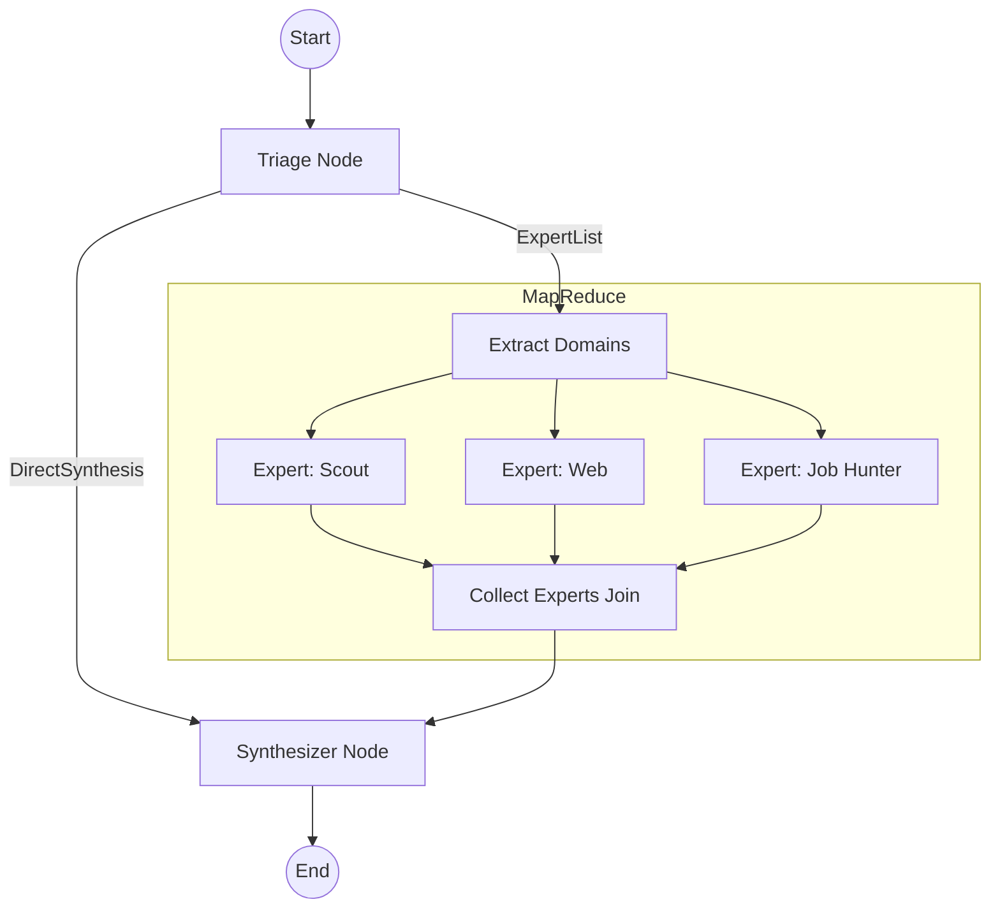

# ODIS Architecture Guide

This document describes the agentic orchestration architecture of ODIS, following the migration to `pydantic-graph`.

## 1. Design Philosophy

ODIS leverages a **"Background-First"** and **"Data-Pipeline"** philosophy. 
Instead of a stateful, multi-turn conversational loop, we treat the agentic workflow as a pure data transformation pipe:
1. **Input**: User request + Search Context.
2. **Execution**: Parallel discovery by specialized experts.
3. **Output**: Consolidated territory synthesis.

## 2. Core Components

### 2.1 One-Shot Interviewer (Auto-Detection)
The legacy multi-turn `Interviewer` has been replaced by a standalone **one-shot PydanticAI agent**.
- **Role**: Extract `SearchCriterias` from unstructured text.
- **Location**: `app/agents/interviewer.py`
- **Trigger**: Direct UI call via `run_autodetect_safe`.
- **Benefit**: Zero state management overhead for the UI.

For technical details on the graph orchestration, see [GRAPH_ARCHITECTURE.md](app/agents/GRAPH_ARCHITECTURE.md).

### 2.2 Orchestration Graph (`pydantic-graph`)
The background analysis is orchestrated by a MapReduce pipeline built with `GraphBuilder`.

### 2.3 Graph Nodes
- **Triage**: Uses a Routing LLM (or static rules) to decide which experts to trigger. It returns either an `ExpertList` (for fan-out) or `DirectSynthesis` (for immediate response).
- **Map (Extract Domains)**: Fans out the `ExpertList` into parallel worker instances.
- **Expert Worker**: Executes a specialized PydanticAI agent (`scout`, `web`, or `job_hunter`) for the focus city.
- **Join (Collect Experts)**: Accumulates artifacts from all workers into a single list using `reduce_list_append`.
- **Synthesizer**: Consumes the aggregated artifacts and generates the final markdown summary for the UI and PDF.

## 3. State & Persistence

### 3.1 `GraphState` Dataclass
We use a pure Python `@dataclass` for the graph state to ensure maximum compatibility with Streamlit's serialization and avoid Pydantic redefinition errors during hot-reloads.

### 3.2 Stateless Execution
The graph is designed to be **stateless**. Each run starts with a fresh state populated from the UI's current criteria. This eliminates the need for complex persistent database sessions for the background workers.

## 4. Background Execution Pipeline

Background tasks are managed via a dedicated store and fragment polling:
1. **UI (`3_Resultats.py`)**: Checks the background store for a specific `criteria_hash`.
2. **Worker (`utils.py`)**: Runs the `pydantic-graph` in a separate thread.
3. **Synchronization**: Results are written back to the store, triggering a UI refresh via Streamlit fragments.

## 5. Expert Agents

- **Scout**: Uses Google Maps and local referentials to analyze territory amenities.
- **WEB**: Uses Google Search Grounding to provide real-time socio-economic context.
- **Job Hunter**: Queries France Travail and specialized job boards for real-time tension data.
- **Scorer**: (Runs outside the graph) Provides a mathematical explanation of the ODIS weighted scores.
