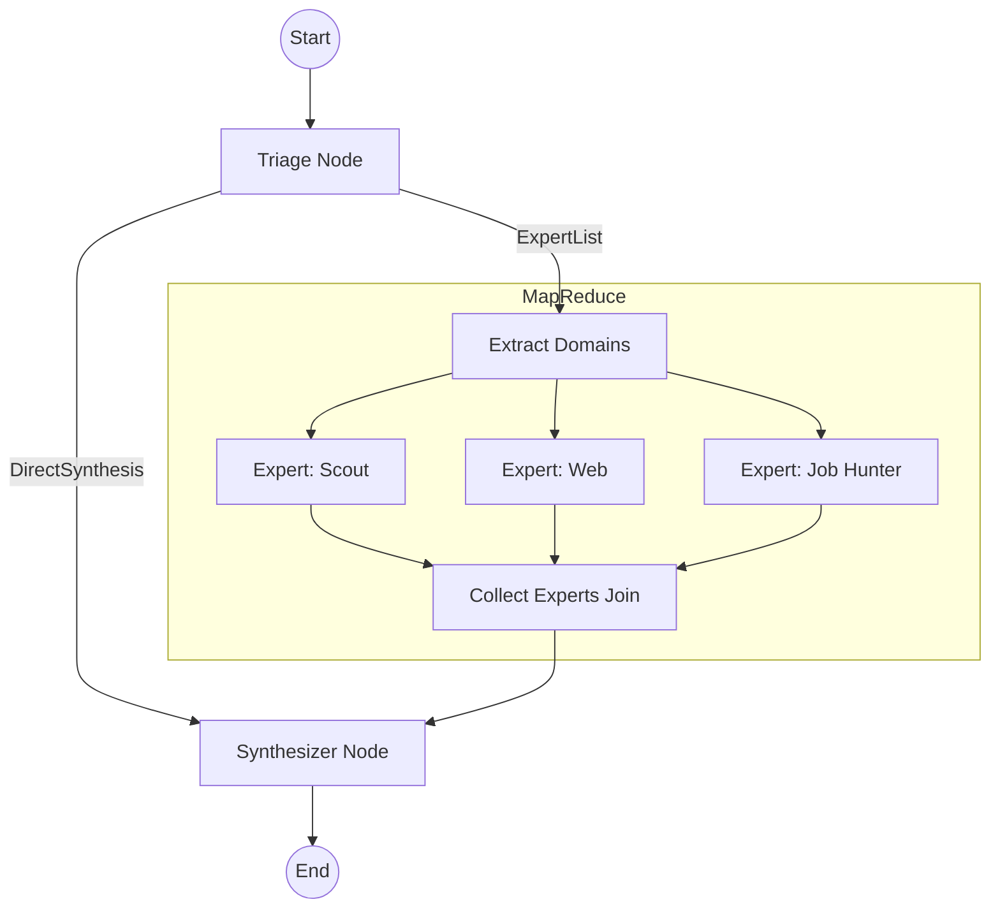

# ODIS Architecture Guide

This document describes the agentic orchestration architecture of ODIS, following the migration to `pydantic-graph`.

## 1. Design Philosophy

ODIS leverages a **"Background-First"** and **"Data-Pipeline"** philosophy. 
Instead of a stateful, multi-turn conversational loop, we treat the agentic workflow as a pure data transformation pipe:
1. **Input**: User request + Search Context.
2. **Execution**: Parallel discovery by specialized experts.
3. **Output**: Consolidated territory synthesis.

## 2. Core Components

### 2.1 One-Shot Interviewer (Memory Injection)
The legacy multi-turn `Interviewer` has been replaced by a standalone **one-shot PydanticAI agent** that supports **state re-injection**.
- **Role**: Extract `SearchCriterias` from unstructured text.
- **Memory**: Supports memory injection via the `ODISContextBuilder`, allowing it to "see" previously identified criteria in its system prompt.
- **Location**: `app/agents/interviewer.py`
- **Trigger**: Direct UI call via `run_autodetect_safe`.
- **Benefit**: Zero state management overhead for the UI while maintaining context awareness.

For technical details on the graph orchestration, see [GRAPH_ARCHITECTURE.md](app/agents/GRAPH_ARCHITECTURE.md).

### 2.2 Orchestration Graph (`pydantic-graph`)
The background analysis is orchestrated by a MapReduce pipeline built with `GraphBuilder`.

### 2.3 Graph Nodes
- **Triage**: Uses a Routing LLM (or static rules) to decide which experts to trigger. It returns either an `ExpertList` (for fan-out) or `DirectSynthesis` (for immediate response).
- **Map (Extract Domains)**: Fans out the `ExpertList` into parallel worker instances.
- **Expert Worker**: Executes a specialized PydanticAI agent (`scout`, `web`, or `job_hunter`) for the focus city.
- **Join (Collect Experts)**: Accumulates artifacts from all workers into a single list using `reduce_list_append`.
- **Synthesizer**: Consumes the aggregated artifacts and generates the final markdown summary for the UI and PDF.

## 3. State & Persistence

### 3.1 `GraphState` Dataclass
We use a pure Python `@dataclass` for the graph state to ensure maximum compatibility with Streamlit's serialization and avoid Pydantic redefinition errors during hot-reloads.

### 3.2 Stateless Execution
The graph is designed to be **stateless**. Each run starts with a fresh state populated from the UI's current criteria. This eliminates the need for complex persistent database sessions for the background workers.

## 4. Background Execution Pipeline

Background tasks are managed via a dedicated store and fragment polling:
1. **UI (`3_Resultats.py`)**: Checks the background store for a specific `criteria_hash`.
2. **Worker (`utils.py`)**: Runs the `pydantic-graph` in a separate thread.
3. **Synchronization**: Results are written back to the store, triggering a UI refresh via Streamlit fragments.

## 5. Expert Agents

- **Scout**: Uses Google Maps and local referentials to analyze territory amenities.
- **WEB**: Uses Google Search Grounding to provide real-time socio-economic context.
- **Job Hunter**: Queries France Travail and specialized job boards for real-time tension data.
- **Scorer**: (Runs outside the graph) Provides a mathematical explanation of the ODIS weighted scores.

## 6. Observability (Logfire)

ODIS uses **Pydantic Logfire** for end-to-end tracing and performance monitoring.

### 6.1 Instrumentation Scope
- **Native Agents**: All PydanticAI agents are automatically instrumented to capture prompts, outputs, and token usage.
- **Orchestration Nodes**: Graph nodes are wrapped with `@logfire.instrument` to visualize the MapReduce fan-out/fan-in performance.
- **Scoring Engine**: Methods within `ScoringEngine` are instrumented to identify bottlenecks in the multi-criteria calculation pipeline. (Note: Class-level instrumentation was removed to preserve classmethod access during testing).
- **Web Requests**: `HTTPX` instrumentation tracks the latency of external tools (Brave Search, RAG services).

### 6.2 Session Grouping
Each user run is wrapped in a high-level span labeled `"ODIS Session"` (in `main.py`), allowing developers to group all logs and traces related to a single user interaction by filtering for that span or using the `interaction_id` attribute.

## 7. Metadata-Driven Context Injection (ACL)

To avoid manual "cherry-picking" of fields for each agent, ODIS uses a dynamic, metadata-driven architecture for prompt context construction.

### 7.1 Visibility Tags (`odis_visibility`)
Pydantic models in `core/models.py` are decorated with visibility tags in `json_schema_extra`. This allows for a formal Access Control List (ACL) directly in the data models.

### 7.2 Generic Recursive Builder
The `ODISContextBuilder` in `agents/state.py` automatically generates context blocks by:
1. Iterating over model fields recursively.
2. Filtering fields based on the component's `visibility_key`.
3. Using `Field.description` as the human-readable JSON key for the LLM.
4. Automatically simplifying complex objects (like `CriteriaItem`) into plain strings.

For the full visibility matrix and contract details, see [AGENT_CONTEXTS.md](app/agents/AGENT_CONTEXTS.md).

## 8. Data Integrity & PLM Commune Consolidation

To prevent administrative discrepancies for Paris, Lyon, and Marseille, ODIS enforces a strict **Commune-Level Only** standard. 

### 8.1 ETL Aggregation Pipeline
During the build phase (`pipeline/build.py`), all individual arrondissement-level data points (e.g., Paris 1er, Lyon 3e, Marseille 8e) are programmatically consolidated into their parent commune codes:
- **Summing**: Counts and capacities (e.g., POIs, schools, places in nurseries, number of associations) are summed up.
- **Population Weighting**: Rates and ratios (e.g., housing vacancy, wait times, coverages, average rents) are calculated as a population-weighted average of their component arrondissements.
- **Filtering**: All sub-arrondissement codes are filtered out of the final parquet files.

### 8.2 Descendant Cascade Filtering
All vertical and reference tables (including CCAS lists, refugee associations, formations, and POIs) are consolidated at the parent level. Any references to child arrondissements are mapped to parent INSEE codes, ensuring that descriptive details, E2E scoring, maps, and PDF exports only reference global parent communes.

## 9. Configuration-Driven Scoring Weights & Normalization

To maintain strict architectural separation between user-customized priority settings and global domain standards:
- **No Hardcoded UI Multipliers**: The scoring weights for all baseline and active criteria flow purely and dynamically from [scores_config.yaml](file:///Users/jacques/dev/13_odis_stream2/app/scores_config.yaml).
- **Expert Tuning Abstraction**: Priority settings are handled cleanly through `criteria_weights` and are never hardcoded inside forms or engine defaults, ensuring maximum configurability and transparency for E2E reports.

### 9.1 Category-Level Normalization (Percentile-Based)
To eliminate implicit weight biases across categories (e.g., categories with low raw score distributions being dominated by others), ODIS normalizes each category score using a **percentile ranker** before applying the final global weights.
- **Ranks Centiles**: All valid category scores are dynamically mapped to a uniform distribution in $[0, 1]$ using `.rank(pct=True)`.
- **Preserves Absolute Zeroes**: Any commune with a category score of exactly `0.0` (i.e. meeting zero active indicators) remains strictly at `0.0` post-ranking to prevent artificial inflation.
- **Robust Variance Protection**: If all communes share the identical category score, ranking is automatically bypassed to avoid compression.

## 10. Shortlisted City (Ville Pressentie) Comparison Architecture

To allow Social Workers to evaluate and compare a pre-conceived city (e.g., Le Mans) directly against Paris (current city) and the Top 5 recommended results, ODIS implements a **shortlisted city comparison flow (Feature F-61)**:

### 10.1 Unified Force-Scoring Pattern
The shortlisted city is treated with the exact same scoring pipeline as the current city:
1. **Force-Scoring**: It is force-included in the `communes_to_score` DataFrame inside `ScoringEngine.run` regardless of geographic boundaries (department/region filters).
2. **Identical Submetrics**: It passes through the exact same scoring rules (`_compute_scores`), receiving identical thimatic scores, sub-metrics, and statistics as all other candidate communes.
3. **Top 5 Exclusion**: In the post-scoring phase, it is excluded from the final Top 5 recommended list (`self.results`) so that the recommendations remain pure, and is stored in `SearchResultsData.commune_pressentie`.

### 10.2 Structured AI Pitch Generation
- **Context Injection**: The `ODISContextBuilder` recursively builds and injects the scored metrics of `commune_pressentie` into the Refiner agent's prompt under `"Commune pressentie à évaluer"`.
- **Structured Output**: The Refiner agent's Pydantic `RefinerResult` schema has an explicit `pitches_per_city` field description that mandates the inclusion of both the Top 5 recommended cities and the shortlisted city.
- **Unified Retrieval**: The `SearchResultsData.get_by_code` helper is extended to look up the INSEE code across both `commune_pressentie` and `current_geo`, enabling seamless UI detail renderings, CCAS actions, and semantic analysis.

### 10.3 Premium Visual Layering
- **UI Button**: The shortlisted city is featured at the top of the search results with a distinct **J'Accueille Yellow (`#F5D819`)** theme.
- **Map Highlights**: The Folium map layer highlights the shortlisted city's boundary using a yellow border (rank `-1`), and positions a premium, self-contained **Material Design push_pin SVG icon** at the centroid of its polygon.

