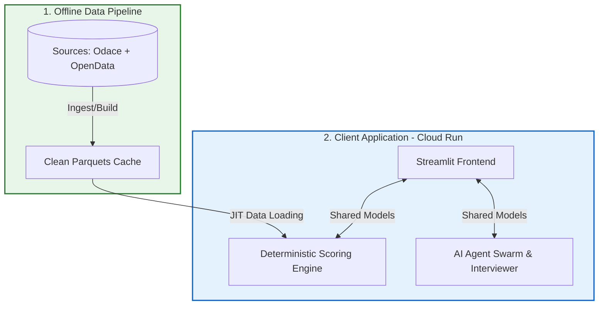

# ODIS Project Architecture Guide

This document describes the high-level software architecture of ODIS, defining its macro-components, core design patterns, data flows, and deployment characteristics on Google Cloud Run.

---

## 🗺️ Architectural Document Index

For granular implementation details, refer to the domain-specific architecture documents:

*   **App UI & State Management**: [app/APP_ARCHITECTURE.md](file:///Users/jacques/dev/13_odis_stream2/app/APP_ARCHITECTURE.md) (Streamlit integration, session lifecycle, and resource optimization).
*   **Scoring Configuration & Formulas**: [SCORING.md](file:///Users/jacques/dev/13_odis_stream2/SCORING.md) (Mathematical models, quantiles, and normalization rules).
*   **Offline Data & Ingestion Pipelines**: [pipeline/PIPELINE_ARCHITECTURE.md](file:///Users/jacques/dev/13_odis_stream2/pipeline/PIPELINE_ARCHITECTURE.md) (Odace platform integration, shadow staging, and data contracts).
*   **AI Agent Orchestration Swarm**: [app/agents/GRAPH_ARCHITECTURE.md](file:///Users/jacques/dev/13_odis_stream2/app/agents/GRAPH_ARCHITECTURE.md) (Multi-agent `pydantic-graph` triage, domain expert workers, ACL contexts, and tools).
*   **Quality Assurance & Testing Suite**: [tests/QA_ARCHITECTURE.md](file:///Users/jacques/dev/13_odis_stream2/tests/QA_ARCHITECTURE.md) (Logical invariants, mock strategies, and golden eval judging).

---

## 1. Core Macro-Components

ODIS is structurally partitioned into two decoupled subsystems, separating the client-facing runtime from the offline ETL build pipeline.

### 1.1 The ODIS Stream2 App (`app/`)
The runtime app runs in a web-server container and is composed of:
1.  **Streamlit Web Interface**: Manages page routing, layout widgets, and local WebSocket/HTTP session state. Detailed in [app/APP_ARCHITECTURE.md](file:///Users/jacques/dev/13_odis_stream2/app/APP_ARCHITECTURE.md).
2.  **Scoring Engine**: A pandas-based mathematical engine that calculates and ranks candidate communes dynamically based on user criteria. Detailed in [SCORING.md](file:///Users/jacques/dev/13_odis_stream2/SCORING.md).
3.  **AI Swarm (`pydantic-graph`)**: An asynchronous multi-agent MapReduce pipeline that enriches targeted communes with qualitative context. Detailed in [app/agents/GRAPH_ARCHITECTURE.md](file:///Users/jacques/dev/13_odis_stream2/app/agents/GRAPH_ARCHITECTURE.md).
4.  **Standalone Agents**: One-shot utility agents, such as the Interviewer agent which translates natural language user intents into structured search criteria. Detailed in [app/agents/GRAPH_ARCHITECTURE.md#1-one-shot-interviewer-memory-injection](file:///Users/jacques/dev/13_odis_stream2/app/agents/GRAPH_ARCHITECTURE.md#1-one-shot-interviewer-memory-injection).

### 1.2 The ODIS Data Pipeline (`pipeline/`)
An offline ETL command-line tool executed during build/deployment phases to prepare reference datasets:
1.  **Odace Ingestion**: Pulls pre-processed tables from the Odace Silver API. Detailed in [pipeline/PIPELINE_ARCHITECTURE.md#1-odace-silver-ingestion-use_odace-true](file:///Users/jacques/dev/13_odis_stream2/pipeline/PIPELINE_ARCHITECTURE.md#1-odace-silver-ingestion-use_odace-true).
2.  **Legacy Fetch & Cleaners**: Downloads and normalizes raw open datasets from external sources (e.g. data.gouv) as fallback routes. Detailed in [pipeline/PIPELINE_ARCHITECTURE.md#2-declarative-schema-verification](file:///Users/jacques/dev/13_odis_stream2/pipeline/PIPELINE_ARCHITECTURE.md#2-declarative-schema-verification).
3.  **Consolidation Builder**: Consolidates arrondissement metrics into global commune rows (Paris, Lyon, Marseille) and calculates static baseline ranks. Detailed in [pipeline/PIPELINE_ARCHITECTURE.md#1-shadow-staging-&-atomic-swaps](file:///Users/jacques/dev/13_odis_stream2/pipeline/PIPELINE_ARCHITECTURE.md#1-shadow-staging--atomic-swaps).

---

## 2. Core Architectural Principles & Patterns

Developers extending ODIS must adhere to these foundational structural patterns:

### 2.1 Model-First Data Contracts
All boundary interfaces between the UI, the Scoring Engine, the offline pipeline, and the AI swarm are governed by strict Pydantic schemas in [models.py](file:///Users/jacques/dev/13_odis_stream2/app/core/models.py). Detailed in [app/APP_ARCHITECTURE.md#1-core-philosophy-model-first](file:///Users/jacques/dev/13_odis_stream2/app/APP_ARCHITECTURE.md#1-core-philosophy-model-first):
- **`SearchCriterias`**: The single source of truth for user inputs and criteria weight profile.
- **`SearchResultsData`**: The container for all current session recommendations, geographical bounding geometries, and metadata.
- **`CommuneResult`**: The structural model representing a single target commune, holding both mathematical metrics and qualitative agent findings (`expert_analysis`).

### 2.2 Asynchronous State Reducers
The AI Agent Swarm is designed as a **stateless, side-effect-free pipeline**. 
- To avoid locking the Streamlit UI, the graph runs in a background worker thread.
- The UI passes a serialized snapshot of the state to the worker.
- Once the worker completes execution, the returned updates are merged back into the active session state using a **reducer pattern** implemented via `merge_search_results` in [state.py](file:///Users/jacques/dev/13_odis_stream2/app/agents/state.py). Detailed in [app/APP_ARCHITECTURE.md#2-state-machine-pydantic-graph--reducers](file:///Users/jacques/dev/13_odis_stream2/app/APP_ARCHITECTURE.md#2-state-machine-pydantic-graph--reducers).
- No agent or background thread may mutate `st.session_state` directly.

### 2.3 Decoupling AI from Business Logic
To control costs, eliminate latency bottlenecks, and protect against LLM hallucinations, the ranking of communes is **100% deterministic**.
- The Core Scoring Engine uses deterministic formulas (percentile ranks, quantile bounds, and population-weighted averages) to compute scores. Detailed in [SCORING.md](file:///Users/jacques/dev/13_odis_stream2/SCORING.md).
- Generative AI is strictly used as an **enrichment layer** (generating textual briefings and curated job postings) for already-selected communes. If Vertex AI or the Gemini API is offline, the core scoring and mapping features remain fully operational. Detailed in [app/agents/GRAPH_ARCHITECTURE.md](file:///Users/jacques/dev/13_odis_stream2/app/agents/GRAPH_ARCHITECTURE.md).

---

## 3. Deployment & Runtime Lifecycle (Google Cloud Run)

ODIS is deployed as a Docker container on Google Cloud Run. The serverless, horizontal-scaling nature of this platform introduces specific constraints:

### 3.1 Session Affinity (Horizontal Scaling)
Streamlit maintains its WebSocket connections and user session state (`st.session_state`) in the memory of the active container process. Background execution threads are also local to that process.
- **Affinity Requirement**: When scaling to multiple Cloud Run instances, **Session Affinity** must be enabled. Detailed in [app/APP_ARCHITECTURE.md#7-cloud-run-&-statelessness-quirks](file:///Users/jacques/dev/13_odis_stream2/app/APP_ARCHITECTURE.md#7-cloud-run-&-statelessness-quirks).
- Without session affinity, client polling requests from `@st.fragment(run_every=2.0)` will bounce between instances, leading to isolated state cache misses and duplicate, redundant background graph executions.

### 3.2 Stateless, Ephemeral File System
Cloud Run containers are ephemeral and can scale to zero or reboot at any time.
- **Static Configuration**: All configuration files, baseline parquets, and skill card Markdown instructions must be baked into the Docker image at build time. 
- **Graceful Termination**: In-progress graph executions are vulnerable to SIGTERM events during container scaling/reboots. The system recovers by letting the client detect the WebSocket drop and automatically re-triggering the analysis, initiating a fresh graph run on the new container instance. Detailed in [app/APP_ARCHITECTURE.md#7-cloud-run-&-statelessness-quirks](file:///Users/jacques/dev/13_odis_stream2/app/APP_ARCHITECTURE.md#7-cloud-run-&-statelessness-quirks).
- **External Caching**: Telemetry is logged synchronously to BigQuery at the end of the graph execution to guarantee persistence outside the container lifecycle.

---

## 4. Development Tooling & Code Quality

ODIS leverages high-performance, Rust-based developer tools to enforce code style and verify type correctness across the codebase:

### 4.1 Ruff (Linter & Formatter)
- **Rules & Standards**: Project-wide formatting and lint checking are managed by **Ruff** (configured in [ruff.toml](file:///Users/jacques/dev/13_odis_stream2/ruff.toml)), targeting Python 3.14.
- **Ignores**: To maintain compatibility with dynamic runtime behaviors and path overrides (e.g. `sys.path` injection), specific rules like `E402` (module imports not at top), style conventions, and unused variables are ignored.

### 4.2 Ty (Type Checker)
- **Modern Generic Support**: **Ty** (Astral's Rust-based type checker, configured in [ty.toml](file:///Users/jacques/dev/13_odis_stream2/ty.toml)) is used for semantic type checking. Ty natively supports PEP 695 and resolves modern typing constructs like `pydantic-graph`'s generic `StepContext[State, Deps, Input]` without errors.
- **Search Paths**: The `extra-paths = ["app"]` setting registers first-party code paths, enabling proper import resolution.
- **Permissive Mode**: Specific strict syntax/overload checks and third-party library warning diagnostics are ignored to prevent build breakages on pandas or streamlit data types.

### 4.3 CI/CD Quality Gates
- **Automation**: Code quality gates are executed automatically as part of the Google Cloud Build workflow (defined in [cloudbuild.yaml](file:///Users/jacques/dev/13_odis_stream2/cloudbuild.yaml)).
- **Build Sequence**: The build pipeline installs dependencies, then runs `ruff check`, `ruff format --check`, and `ty check` sequentially before proceeding to execute `pytest` and compiling the Docker container.

