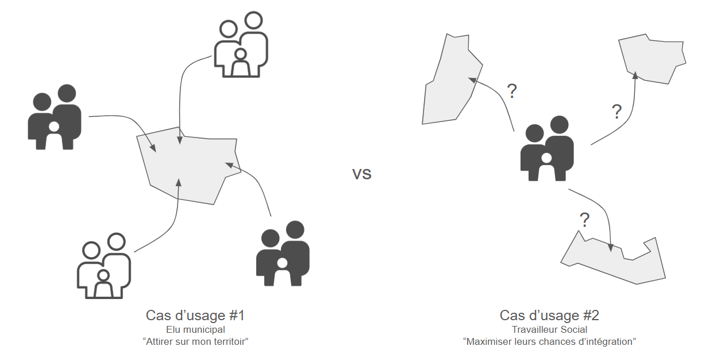
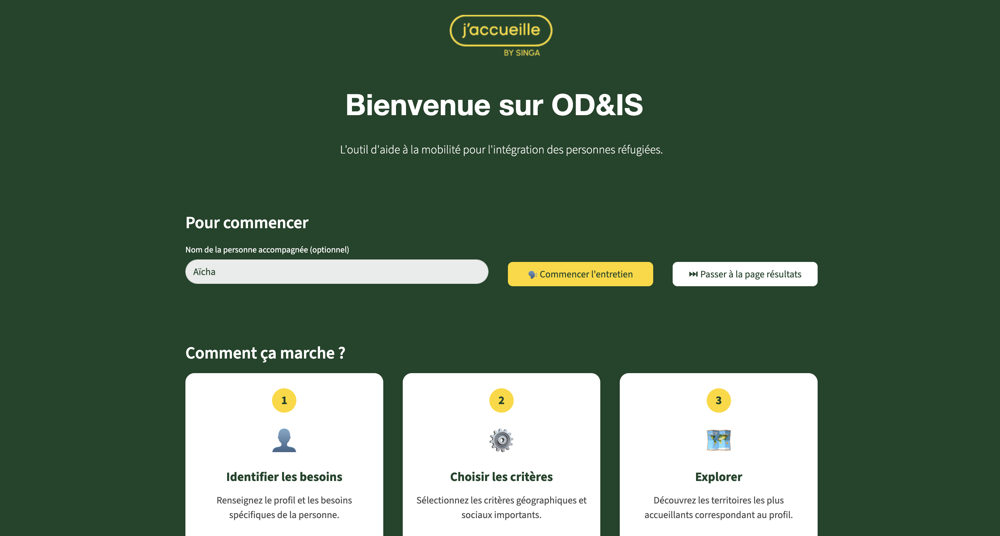
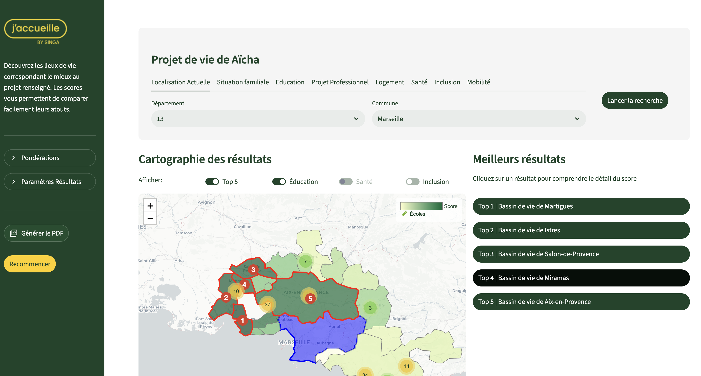
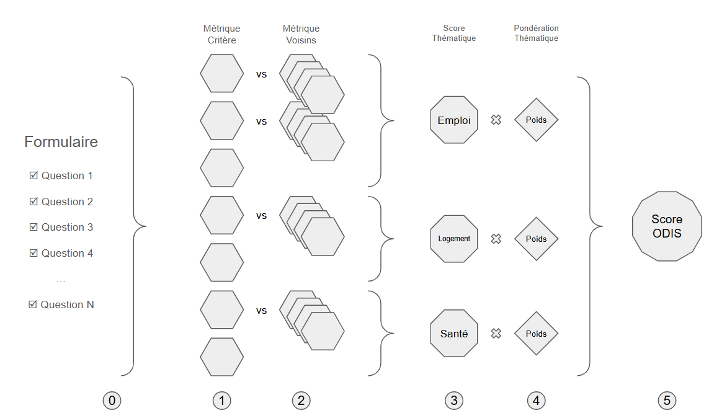

# OD&IS - Prototype d'Aide à la Localisation (Recherche Inversée)

[](https://www.python.org/downloads/release/python-3100/)
[](https://streamlit.io)
[](../../LICENSE)

## 🎯 Contexte et Objectifs du Projet

Ce projet, surnommé **"Stream 2"**, est un prototype fonctionnel explorant une approche de **"recherche inversée"** pour l'aide à la relocalisation des personnes et familles accompagnées par des structures d'insertion comme le programme [J'accueille](https://www.jaccueille.fr/) de [SINGA](https://www.singafrance.com/).

Il s'inscrit en complément du projet principal [13_odis](https://github.com/dataforgoodfr/13_odis) (ou "Stream 1"), qui se concentre sur l'exploration et la comparaison d'indicateurs pour une commune déjà sélectionnée.

L'innovation de ce prototype est de renverser la logique : au lieu de partir d'un lieu, **on part des besoins et du projet de vie de la personne**. Le persona principal est le travailleur social qui, à travers cet outil, peut identifier les territoires les plus prometteurs pour la réussite d'un projet d'intégration.



Ce prototype a un triple objectif :

1.  **Valider la pertinence de l'approche** auprès des futurs utilisateurs (travailleurs sociaux, accompagnants).
2.  **Démontrer la faisabilité technique** de construire un score de pertinence en utilisant exclusivement des données ouvertes (Open Data).
3.  **Promouvoir l'intérêt de cette démarche** auprès de potentiels partenaires, décideurs et financeurs.

## ✨ Fonctionnalités Principales

- **Profil Personnalisé :** Définissez un "projet de vie" détaillé incluant la composition du foyer, le niveau scolaire des enfants, les métiers visés, les besoins en formation, etc.
- **Pondération Avancée :** Ajustez l'importance de chaque grande catégorie ou utilisez des profils prédéfinis (Famille, Santé, Emploi). Affinez la priorité de critères spécifiques (ex: "Logement Social" prioritaire).
- **Vue par Bassin de Vie :** Agrégez les résultats à l'échelle des "bassins de vie" de l'INSEE pour une analyse plus macroscopique et pertinente des territoires fonctionnels.
- **Scoring Intelligent :** Chaque commune de France est évaluée sur sa compatibilité avec le profil. La taille de la population n'est plus un filtre mais un critère de score, favorisant les localités de taille pertinente.
- **Système de "Binômes" :** L'algorithme associe de manière unique des communes voisines (`binômes`) pour proposer des solutions conjointes qui répondent à l'ensemble des besoins, même si une seule commune ne le pourrait pas.
- **Carte Interactive :** Visualisez les localités les mieux notées, leur score, et superposez des couches d'informations additionnelles (écoles, établissements de santé, services d'inclusion).
- **Résultats Détaillés & Export PDF :** Explorez les 5 meilleurs résultats avec une analyse de leurs points forts et exportez un rapport PDF complet pour la famille accompagnée.
- **Scénarios de Démonstration :** Chargez rapidement des profils pré-configurés pour découvrir le potentiel de l'outil.

## 📸 Aperçu de l'Application

|                         Page d'accueil                         |                      Vue détaillée d'un résultat                       |
| :------------------------------------------------------------: | :--------------------------------------------------------------------: |
|  |  |

## 🚀 Installation et Lancement

### Prérequis

- [Python 3.10+](https://www.python.org/)
- Un environnement virtuel (recommandé).

### Instructions

1.  **Clonez le dépôt :**

    ```bash
    git clone https://github.com/jbesan/13_odis_stream2.git
    cd 13_odis
    ```

2.  **Créez et activez un environnement virtuel :**

    ```bash
    python3 -m venv .venv
    source .venv/bin/activate
    ```

3.  **Installez les dépendances :**

    ```bash
    pip install -r app/requirements.txt
    ```

4.  **Lancez l'application Streamlit :**
    ```bash
    streamlit run app/1_Accueil.py
    ```
    L'application devrait s'ouvrir dans votre navigateur web.

## ⚙️ Fonctionnement : Le Moteur de Scoring

Le cœur de l'application est un pipeline de scoring qui évalue les communes (ou les bassins de vie) en fonction du profil utilisateur.

1.  **Filtrage Géographique :** Le moteur délimite la zone de recherche. Plutôt qu'un simple rayon, il utilise une logique géospatiale :
    - **Recherche par distance :** Sélectionne les communes/bassins de vie dont le centroïde est dans le rayon de recherche.
    - **Recherche par zone :** Sélectionne les communes/bassins de vie qui intersectent un département ou une région.
2.  **Calcul des Critères :** Il calcule ensuite des dizaines de scores individuels pour chaque commune (ex: adéquation des offres d'emploi, disponibilité de logements sociaux, score de population). Ces scores sont normalisés pour permettre une comparaison équitable.
3.  **Logique de Binôme :** Le moteur identifie les communes voisines et les évalue par paires (`binôme`). Cela permet de recommander deux villes qui, ensemble, remplissent tous les critères (ex: l'une a les emplois, l'autre les logements). Une petite pénalité (`binome_penalty`) est appliquée pour privilégier les solutions au sein d'une même commune (`monôme`) lorsque c'est possible.
4.  **Agrégation par Catégorie :** Les scores des critères individuels sont ensuite moyennés pour former des scores de catégories (Emploi, Logement, Éducation, etc.).
5.  **Agrégation par Bassin de Vie (Optionnel) :** Si l'utilisateur choisit cette vue, **tous les scores** des communes (y compris Éducation, Santé, Inclusion) sont agrégés au niveau du bassin de vie par une **moyenne pondérée par la population**. Cela permet d'obtenir une vue d'ensemble cohérente où les services des grandes communes pèsent plus lourd.
6.  **Score Pondéré Final :** Enfin, un `weighted_score` global est calculé pour chaque entité (commune, binôme ou bassin de vie) en appliquant les poids définis par l'utilisateur. Les résultats sont ensuite classés selon ce score final.



### Critères de Scoring

Le score est calculé à partir d'une multitude de critères, regroupés en grandes catégories. Chaque critère est normalisé pour permettre une comparaison équitable. Voici la liste des critères utilisés :

**Catégorie : Emploi**

- **Taux Besoin Emploi** : Mesure le nombre d'emplois non pourvus pour 1000 habitants, indiquant la demande de main-d'œuvre locale.
- **Adéquation Compétences/Emploi** : Évalue la correspondance entre les métiers recherchés par les adultes du foyer et les familles de métiers les plus demandées dans la zone.
- **Adéquation Besoins/Formations** : Mesure la présence de centres de formation proposant les cursus recherchés par les adultes du foyer.

**Catégorie : Logement**

- **Taux de Logements Vacants** : Calcule le pourcentage de logements vacants, un indicateur de la disponibilité sur le marché locatif privé.
- **Taux de Logements Sociaux Inoccupés** : Mesure la part des logements sociaux vacants ou vides, indiquant une disponibilité potentielle dans le parc social.
- **Taux de Grandes Résidences Principales** : Pour l'hébergement "chez l'habitant", ce critère évalue la proportion de résidences principales de 5 pièces et plus.

**Catégorie : Éducation**

- **Taux de Classes à Risque de Fermeture** : Identifie les écoles où des classes risquent de fermer faute d'élèves, ce qui peut être une opportunité pour de nouvelles familles.
- **Taux de Couverture Petite Enfance** : Évalue la disponibilité des modes de garde (crèches, assistantes maternelles) pour les jeunes enfants (< 3 ans), basé sur les données de la CAF.
- **Education**: Annuaire de l'éducation (Data.gouv), Effectifs (Data.gouv), Taux de couverture Petite Enfance (CAF), Crèches (BPE/INSEE), Formations (Data.gouv).

**Catégorie : Inclusion & Vie Locale**

- **Taux de Services d'Inclusion** : Mesure la densité de services dédiés à l'inclusion (apprentissage du français, aide juridique, etc.) pour 1000 habitants.
- **Présence de Soutien Spécifique** : Vérifie la présence de services répondant aux besoins spécifiques exprimés dans le formulaire (santé, handicap, etc.).
- **Taille de la Population** : La population de la commune est utilisée comme un critère, favorisant les communes de taille intermédiaire pour un meilleur équilibre accueil/intégration.
- **Couleur Politique** : Prend en compte l'affiliation politique de la municipalité, en valorisant celles jugées plus favorables à l'accueil.

**Catégorie : Mobilité**

- **Distance depuis le lieu actuel** (`mob_dist_scaled`) : Score basé sur la proximité par rapport à la commune de départ de la personne.
- **Appartenance à la même agglomération (EPCI)** (`mob_epci_scaled`) : Vérifie si la commune proposée est dans le même Établissement Public de Coopération Intercommunale (EPCI) que la commune de départ.
- **Présence d'une Gare (`mob_gare_scaled`)** : Bonifie les communes disposant d'une gare ferroviaire (Source: Odace).

## 🛠️ Stack Technique

- **Framework Applicatif :** [Streamlit](https://streamlit.io/)
- **Analyse de Données :** [Pandas](https://pandas.pydata.org/), [GeoPandas](https://geopandas.org/), [NumPy](https://numpy.org/)
- **Scoring & Normalisation :** [Scikit-learn](https://scikit-learn.org/)
- **Cartographie Interactive :** [Folium](https://python-visualization.github.io/folium/) & [streamlit-folium](https://github.com/randyzwitch/streamlit-folium)
- **Graphiques :** [Plotly Express](https://plotly.com/python/plotly-express/)
- **Sources de Données :** Les données sont agrégées depuis de nombreuses sources ouvertes, notamment l'INSEE, Data.gouv.fr, France Travail (Pôle Emploi), Odace (Gares), etc.

> Note
> Le jeu de données principal qui se trouve dans `odis_june_2025_jacques.parquet` est une compilation de plusieurs autres jeux de données. La logique de cette compilation se trouve dans le Notebook `odis_stream2_data_gathering.ipynb`

## 📂 Structure du Projet

Le code de l'application Streamlit est organisé de manière modulaire au sein du répertoire app/ pour séparer les différentes logiques :

```
app/
├── 1_Accueil.py
├── config.py
├── data_loader.py
├── maps.py
├── scoring.py
├── ui.py
├── pages/
│ ├── 2_Formulaire.py
│ └── 3_Resultats.py
└── requirements.txt
```

- 1_Accueil.py : C'est le point d'entrée principal de l'application multipage. Il affiche la page d'accueil.
- pages/2_Formulaire.py : La deuxième page de l'application, qui contient le formulaire du projet de vie.
- pages/3_Resultats.py : La troisième page qui affiche les résultats du scoring.
- ui.py : Ce fichier est responsable de la création de tous les composants de l'interface utilisateur avec Streamlit.
- scoring.py : Le cœur logique du prototype. Il contient l'ensemble du pipeline de traitement et de notation, optimisé pour la performance.
- maps.py : Regroupe toutes les fonctions liées à la génération des cartes interactives avec Folium.
- config.py : Un fichier central pour la configuration.
- data_loader.py : Contient la logique pour charger les données.

## 🔮 Feuille de Route et Améliorations Futures

Ce prototype est une base solide qui peut être grandement améliorée :

- **⭐ Fonctionnalités :**

  - **Comptes Utilisateurs :** Permettre de sauvegarder, nommer et gérer plusieurs scénarios de "projets de vie".
  - **Filtres Avancés :** Ajouter des filtres plus fins (ex: exclure certaines régions, filtrer par couleur politique).
  - **Comparaison des Résultats :** Ajouter une fonction pour comparer 2 ou 3 des meilleurs résultats côte à côte.

- **📊 Données & Scoring :**

  - **Intégrer le Loyer Moyen :** Ajouter le loyer moyen comme critère de score pour mieux évaluer l'accessibilité financière.
  - **Étendre les Sources de Données :** Intégrer plus de jeux de données (transports en commun, services de santé spécifiques, activités culturelles).
  - **Fraîcheur des Données :** Mettre en place un pipeline pour mettre à jour automatiquement les données sous-jacentes.
  - **Affiner les Critères :** Travailler avec des travailleurs sociaux pour affiner la liste des critères et leur pertinence.

- **💻 Technique & UX :**
  - **Refactoring du Scoring :** La logique de scoring a été refactorisée et optimisée, mais peut encore être améliorée pour plus de modularité.
  - **Tests :** Ajouter des tests unitaires et d'intégration pour fiabiliser le pipeline de scoring et l'interface.
  - **Performance :** Optimiser le chargement des données et les calculs de score pour une meilleure fluidité.
  - **Design UI/UX :** Améliorer le design visuel, la mise en page et l'ergonomie sur mobile.

## ⚖️ Licence

Ce projet est sous licence MIT. Consultez le fichier [LICENSE](../../LICENSE) à la racine du projet pour plus de détails.
