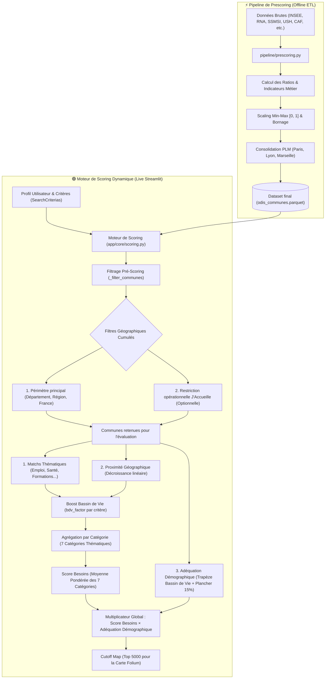

# ⚙️ Logique de Scoring ODIS (Recherche Inversée)

Ce document détaille le fonctionnement interne du moteur de scoring de l'application ODIS. Contrairement aux moteurs de recherche classiques qui filtrent par critères binaires, ODIS calcule un **score de compatibilité** entre une commune et le projet de vie d'une personne.

---

## 🏗️ L'Architecture du Score

### Flux Global du Score (Pre-scoring vs Live-scoring)

Le score global est régi par une architecture à **Multiplicateur Transverse** :

$$\text{Score global} = \text{Adéquation besoins} \times \text{Adéquation démographique}$$

---

## 📐 Déroulement du Calcul en 7 Étapes

### 1. Filtrage Pré-Scoring (`_filter_communes`)

Avant de lancer les calculs géométriques et indicateurs de scoring (très coûteux en performance), ODIS restreint la liste des communes évaluées :

* **Périmètre Géographique Principal** : Filtrage selon le choix de l'utilisateur (Département spécifique, Région, ou France métropolitaine).
* **Filtre Opérationnel J'Accueille** : Si l'utilisateur appartient à l'organisation `jaccueille` et active le filtre de restriction opérationnelle (`org_strategic_locations_filter` à `True`), les communes sont filtrées selon un double critère géographique :
  * **Maille Bassin de Vie** : Le bassin de vie de la commune doit compter au moins un contact accueillant actif (base contacts) OU au moins un prospect inscrit (base prospects).
  * **Maille Département** : La présence d'une zone stratégique dans un département identifie les bassins de vie opérationnels qui la recouvrent.
  * *Calcul* : Un **Inner Join** (intersection) de ces deux mailles détermine la liste des bassins de vie opérationnels éligibles. Toutes les communes de ces bassins sont conservées, y compris lorsqu'un bassin de vie traverse une limite départementale.
  * *Exception* : La commune actuelle de l'usager et la commune pressentie de comparaison sont systématiquement exemptées de ce filtrage pour garantir leur évaluation et comparaison dans les résultats.

---

### 2. Proximité Géographique (Distance)

Pour les communes retenues à l'étape 1, un score de distance est calculé par rapport à la localisation actuelle de l'utilisateur :

- On utilise une **décroissance linéaire** : plus la commune est proche, plus le score est élevé ($Score = 1 - \frac{distance}{distance\_max}$).
- Par défaut, la recherche est optimisée dans un rayon de 50 km (ajustable via les bornes de configuration).

---

### 3. L'Adéquation Démographique (Fonction Trapézoïdale sur le Bassin de Vie) 🎯

Contrairement aux indicateurs thématiques, la taille de ville n'est pas un critère noyé dans une catégorie : c'est un **modulateur transverse d'adéquation territoriale** calculé sur la population du **Bassin de Vie (INSEE)**.

#### Pourquoi le Bassin de Vie ?
* Une commune de banlieue métropolitaine (ex: 45 000 hab. aux portes de Lyon ou Paris) évolue dans un bassin de vie de 1,5 à 12 millions d'habitants. En évaluant la population du Bassin de Vie, elle est naturellement distinguée d'une véritable petite ville autonome.
* Une commune satellite rurale (ex: 800 hab. à 10 min d'une petite ville) bénéficie du bassin d'emploi et des services de son pôle.

#### La Fonction Trapézoïdale avec Plancher Résiduel (15%) :
$$C_{\text{pop}} = 0.15 + 0.85 \times \max\left(0, \; \min\left(\frac{pop - a}{b - a}, \; 1, \; \frac{d - pop}{d - c}\right)\right)$$

* **Sur le plateau idéal $[b, c]$** : Adéquation maximale ($100\%$).
* **Entre $a$ et $b$ ou $c$ et $d$** : Rampe de tolérance progressive.
* **Hors bornes (ex: Métropole de 1,5M pour une recherche Petite Ville)** : Le score ne tombe pas à 0.0 mais au **plancher résiduel de 15%** ($0.15$). Cela évite d'éteindre la carte ou de créer des trous blancs arbitraires tout en garantissant l'exclusion du Top 5.

#### Bornes de configuration (`app/config.py`) :

| Profil recherché | Plancher $a$ | Plateau idéal $[b, c]$ (100%) | Pente haute $d$ | Typologie territoriale |
| :--- | :---: | :---: | :---: | :--- |
| **🚜 Commune rurale** | $0$ | **$1\,000$ à $30\,000$ hab.** | $60\,000$ hab. | Campagnes profondes, massifs et petits bourgs ruraux |
| **🏡 Bourg** | $2\,000$ | **$10\,000$ à $70\,000$ hab.** | $130\,000$ hab. | Territoires de bourgs et petites armatures (Sarlat, Dinan, Guingamp...) |
| **🏘️ Petite Ville** *(défaut)* | $10\,000$ | **$30\,000$ à $200\,000$ hab.** | $450\,000$ hab. | Sous-préfectures et préfectures (Bergerac, Aurillac, Dieppe, Albi, Périgueux...) |
| **🏙️ Ville moyenne** | $30\,000$ | **$80\,000$ à $500\,000$ hab.** | $1\,200\,000$ hab. | Agglomérations régionales (Pau, Angoulême, Bourges, Poitiers, Brest...) |

---

### 4. L'Enrichissement par le Bassin de Vie sur les Critères Métier (Boost Opportunity) 🚀

On considère qu'une commune n'est pas une île : elle bénéficie des opportunités de son **Bassin de Vie**.

Pour chaque critère thématique (Emploi, Santé, Éducation), nous appliquons une logique de **Boost non-pénalisant** :

- **Formule** : $Score = S_{commune} + (1 - S_{commune}) \times (S_{BassinDeVie} \times factor)$
- **Avantages** :
  - **Non pénalisant** : Si le bassin de vie est pauvre en services, le score local n'est pas dégradé.
  - **Bonus de proximité** : Si des opportunités existent dans le bassin de vie immédiat, elles viennent compenser le manque local.
  - **Factor** : Chaque critère a un facteur de pondération dans `scores_config.yaml` (ex: 0.5 pour l'emploi, 0.8 pour les formations) qui reflète l'accessibilité territoriale du service.

---

### 5. Le Pattern "Baseline Criteria" (Indicateurs Socles) 🛡️

ODIS intègre des **critères de référence (Baselines)** dans `scores_config.yaml`. Contrairement aux critères facultatifs qui s'activent selon les besoins de l'utilisateur, les Baselines sont **systématiquement actives** et contribuent au score global avec des poids fixes.

- **Objectif** : Garantir qu'un standard minimum de qualité territoriale (sécurité, accès aux soins de base, transports durables) soit évalué pour chaque dossier.
- **Visibilité** : Ces critères sont visibles dans les rapports détaillés et utilisés par l'IA pour justifier ses recommandations.

---

### 6. Normalisation et Agrégation des Scores 📊

1. **Échelle commune $[0, 1]$** : Tous les indicateurs du catalogue sont normalisés linéairement entre 0.0 et 1.0.
2. **Score de catégorie ($S_{\text{cat}}$)** : Moyenne pondérée, ligne par ligne, des critères actifs et disponibles de la catégorie, avec les poids effectifs du profil (poids catalogue, boost organisationnel et règle de fréquence).
3. **Score Besoins ($S_{\text{besoins}}$)** : Moyenne pondérée des 7 scores de catégories disponibles selon les curseurs de l'utilisateur (`poids_emploi`, `poids_logement`, `poids_education`, `poids_inclusion`, `poids_sante`, `poids_mobilite`, `poids_territoire`).
4. **Score Global ($S_{\text{global}}$)** :
   $$S_{\text{global}} = S_{\text{besoins}} \times C_{\text{pop}}$$
   L'interface multiplie cet indice par 100 pour l'afficher sur une échelle lisible `0–100%`.

---

## 📋 Catalogue des 56 Indicateurs Métier

Le catalogue `scores_config.yaml` regroupe **56 critères thématiques** répartis sur les 7 catégories :

### 🏠 Logement (17 critères)

| Critère | ID YAML | Calcul | Poids | Baseline | Boost BdV | Description |
| :--- | :--- | :--- | :--- | :--- | :--- | :--- |
| **Vacance Structurelle** | `log_vac_scaled` | Pre-scoring | 1.0 | Non | 0.0 | Taux de vacance (> 2 ans) sur le parc total. |
| **Logements Sociaux Vacants** | `log_soc_inoc_scaled` | Pre-scoring | 3.0 | Non | 0.0 | Taux de logements sociaux inoccupés. |
| **Sous-occupation** | `log_occup_scaled` | Pre-scoring | 1.0 | Non | 0.0 | Part des logements sous-occupés (potentiel d'accueil). |
| **Loyer Moyen (Tous Appt)** | `log_loyer_moyen_appt_all_scaled` | Pre-scoring | 5.0 | Non | 0.0 | Loyer moyen d'annonce au m² (Ensemble appartements). |
| **Loyer Moyen (T1/T2)** | `log_loyer_moyen_appt_t1_t2_scaled` | Pre-scoring | 5.0 | Non | 0.0 | Loyer spécifiquement pour petits appartements. |
| **Loyer Moyen (T3+)** | `log_loyer_moyen_appt_t3_p_scaled` | Pre-scoring | 5.0 | Non | 0.0 | Loyer spécifiquement pour grands appartements. |
| **Loyer Moyen (Maisons)** | `log_loyer_moyen_house_all_scaled` | Pre-scoring | 5.0 | Non | 0.0 | Loyer moyen d'annonce au m² (Maisons). |
| **Délai d'Attente Logement Social** | `log_soc_delay_scaled` | Pre-scoring | 5.0 | Non | 0.0 | Délai moyen d'attribution en mois. |
| **Parc Social Total** | `log_soc_scaled` | Pre-scoring | 2.0 | Non | 0.0 | Taux de logements sociaux sur résidences principales. |
| **Pression de la Demande** | `log_pression_scaled` | Pre-scoring | 2.0 | Non | 0.0 | Rapport demandes / attributions annuelles. |
| **Hébergement Citoyen (J'Accueille)** | `heb_jaccueille_accueillants_score` | Pre-scoring | 5.0 | Non | 0.0 | Familles accueillantes actives et disponibles. |
| **Hébergement Prospect (J'Accueille)** | `heb_jaccueille_prospects_score` | Pre-scoring | 3.0 | Non | 0.0 | Candidats à l'accueil en cours d'instruction. |
| **Structures CHRS** | `heb_chrs_scaled` | Pre-scoring | 2.0 | Non | 0.0 | Capacité d'accueil en CHRS. |
| **Pensions de Famille** | `heb_pension_scaled` | Pre-scoring | 2.0 | Non | 0.0 | Places disponibles en pension de famille. |
| **Résidences Sociales** | `heb_res_soc_scaled` | Pre-scoring | 2.0 | Non | 0.0 | Capacité en résidences sociales. |
| **Intermédiation Locative (IML)** | `heb_iml_scaled` | Pre-scoring | 2.0 | Non | 0.0 | Logements mobilisés en sous-location solidaire. |
| **Résidences Jeunes Actifs** | `heb_fjt_scaled` | Pre-scoring | 2.0 | Non | 0.0 | Foyers et résidences pour jeunes travailleurs. |

### 💼 Emploi & Formations (11 critères)

| Critère | ID YAML | Calcul | Poids | Baseline | Boost BdV | Description |
| :--- | :--- | :--- | :--- | :--- | :--- | :--- |
| **Match Métier ROME (Adulte 1)** | `met_match_adult1_scaled` | Live-scoring | 5.0 | Non | 0.5 | Postes ouverts correspondants au code ROME. |
| **Tension Métier ROME (Adulte 1)** | `met_match_adult1_tension_scaled` | Live-scoring | 3.0 | Non | 0.0 | Indicateur de tension sur les métiers recherchés. |
| **Match SIAE (Adulte 1)** | `met_siae_match_adult1_scaled` | Live-scoring | 3.0 | Non | 0.0 | Structures d'insertion par l'activité économique. |
| **Match Métier ROME (Adulte 2)** | `met_match_adult2_scaled` | Live-scoring | 5.0 | Non | 0.5 | Postes ouverts pour le second adulte. |
| **Tension Métier ROME (Adulte 2)** | `met_match_adult2_tension_scaled` | Live-scoring | 3.0 | Non | 0.0 | Tension sur les métiers du second adulte. |
| **Match SIAE (Adulte 2)** | `met_siae_match_adult2_scaled` | Live-scoring | 3.0 | Non | 0.0 | SIAE pour le second adulte. |
| **Match Formation (Adulte 1)** | `form_match_adult1_scaled` | Live-scoring | 4.0 | Non | 0.8 | Offres de formation professionnelle qualifiantes. |
| **Match Formation (Adulte 2)** | `form_match_adult2_scaled` | Live-scoring | 4.0 | Non | 0.8 | Formations pour le second adulte. |
| **Accompagnement Travail** | `emp_accompagnement_scaled` | Pre-scoring | 2.0 | Non | 0.5 | Présence d'agences France Travail et Missions Locales. |
| **Pépinières & Tiers-Lieux** | `emp_incubateurs_scaled` | Pre-scoring | 1.0 | Non | 0.5 | Espaces de co-working et pépinières d'entreprises. |
| **Dynamisme de l'Emploi** | `emp_dynamisme_scaled` | Pre-scoring | 2.0 | **Oui** | 0.5 | Taux d'emploi et créations nettes d'entreprises. |

### 🤝 Inclusion & Solidarité (9 critères)

| Critère | ID YAML | Calcul | Poids | Baseline | Boost BdV | Description |
| :--- | :--- | :--- | :--- | :--- | :--- | :--- |
| **Services d'Inclusion Ciblés** | `inc_services_incl_scaled` | Live-scoring | 5.0 | Non | 0.0 | Services DORA correspondants aux besoins sélectionnés. |
| **Affinités Associatives** | `inc_asso_add_scaled` | Live-scoring | 4.0 | Non | 0.0 | Densité d'associations correspondant aux centres d'intérêt. |
| **Présence CCAS** | `inc_ccas_scaled` | Pre-scoring | 3.0 | Non | 0.0 | CCAS ou CIAS actif sur la commune. |
| **Épiceries Sociales** | `inc_epicerie_soc_scaled` | Pre-scoring | 2.0 | Non | 0.0 | Épiceries sociales et solidaires à proximité. |
| **Accompagnement Réfugiés** | `inc_asso_refugee_scaled` | Pre-scoring | 3.0 | Non | 0.5 | Associations spécialisées dans l'accueil et l'intégration. |
| **Solidarité & Entraide** | `inc_asso_core_scaled` | Pre-scoring | 2.0 | **Oui** | 0.5 | Tissu associatif de solidarité générale. |
| **Centres Sociaux & MJC** | `inc_centre_soc_scaled` | Pre-scoring | 2.0 | Non | 0.5 | Centres socioculturels et espaces de vie sociale. |
| **Apprentissage du Français (FLE)** | `inc_service_fle_scaled` | Pre-scoring | 4.0 | Non | 0.5 | Cours de Français Langue Étrangère. |
| **Accès Numérique Solidaire** | `inc_conseiller_num_scaled` | Pre-scoring | 2.0 | Non | 0.0 | Conseillers numériques et tiers-lieux d'inclusion. |

### 🎓 Éducation & Famille (7 critères)

| Critère | ID YAML | Calcul | Poids | Baseline | Boost BdV | Description |
| :--- | :--- | :--- | :--- | :--- | :--- | :--- |
| **Petite Enfance** | `edu_petite_enfance_scaled` | Pre-scoring | 3.0 | Non | 0.0 | Taux de couverture Crèches/Assmat (CAF). |
| **École Maternelle** | `edu_maternelle_scaled` | Live-scoring | 2.0 | Non | 0.0 | Présence d'une école maternelle. |
| **École Élémentaire** | `edu_elementaire_scaled` | Live-scoring | 2.0 | Non | 0.0 | Présence d'une école élémentaire. |
| **Collège** | `edu_college_scaled` | Live-scoring | 1.0 | Non | 0.5 | Présence d'un collège dans le bassin de vie. |
| **Lycée** | `edu_lycee_scaled` | Live-scoring | 1.0 | Non | 0.8 | Présence d'un lycée d'enseignement général/professionnel. |
| **Classes à Risque de Fermeture** | `edu_classes_ferm_scaled` | Pre-scoring | 1.0 | Non | 0.5 | Écoles ayant un besoin prioritaire de nouveaux élèves. |
| **Évolution Démographique Jeune** | `youth_decline_scaled` | Pre-scoring | 1.0 | Non | 0.0 | Taux d'évolution de la population de moins de 15 ans. |

### 🩺 Santé (8 critères)

| Critère | ID YAML | Calcul | Poids | Baseline | Boost BdV | Description |
| :--- | :--- | :--- | :--- | :--- | :--- | :--- |
| **Accessibilité Soins (APL)** | `sante_rdv_delay_scaled` | Pre-scoring | 2.0 | **Oui** | 0.0 | Accessibilité Potentielle Localisée aux médecins généralistes. |
| **Hôpital** | `sante_hopital_scaled` | Pre-scoring | 2.0 | Non | 0.8 | Centre hospitalier accessible dans le bassin de vie. |
| **Maternité** | `sante_maternite_scaled` | Pre-scoring | 2.0 | Non | 0.25 | Maternité à proximité. |
| **Soutien Psychologique** | `sante_psy_scaled` | Pre-scoring | 2.0 | Non | 0.0 | Structures de santé mentale et soutien psychologique. |
| **Dialyse** | `sante_dialyse_scaled` | Pre-scoring | 2.0 | Non | 0.0 | Centre de dialyse et soins néphrologiques. |
| **Maison de Santé Pluriprofessionnelle** | `sante_maison_sante_scaled` | Pre-scoring | 2.0 | Non | 0.0 | Maison de santé regroupant professionnels libéraux. |
| **Addictologie** | `sante_addictologie_scaled` | Pre-scoring | 2.0 | Non | 0.0 | CSAPA / CAARUD pour la prise en charge des addictions. |
| **Protection Maternelle & Infantile** | `sante_pmi_scaled` | Pre-scoring | 2.0 | Non | 0.0 | Centre PMI pour le suivi pédiatrique. |

### 🧭 Mobilité (5 critères)

| Critère | ID YAML | Calcul | Poids | Baseline | Boost BdV | Description |
| :--- | :--- | :--- | :--- | :--- | :--- | :--- |
| **Mobilité Durable** | `mob_dur_share_scaled` | Pre-scoring | 3.0 | **Oui** | 0.5 | Part des trajets domicile-travail sans voiture individuelle. |
| **Densité Transports Collectifs** | `mob_trans_pub_density_scaled` | Live-scoring | 3.0 | **Oui** | 0.0 | Nombre d'arrêts de bus/tram/train pour 1000 habitants. |
| **Gare SNCF** | `mob_gare_scaled` | Pre-scoring | 1.0 | **Oui** | 0.0 | Présence d'une gare ferroviaire dans la commune. |
| **Bonus Intercommunalité (EPCI)** | `mob_epci_scaled` | Live-scoring | 1.0 | Non | 0.0 | Appartenance à la même communauté de communes/agglomération. |
| **Distance Proximité** | `mob_dist_current_loc_scaled` | Live-scoring | 1.0 | Non | 0.0 | Décroissance linéaire par rapport au point d'attache. |

### 🌳 Territoire & Cadre de Vie (4 critères)

| Critère | ID YAML | Calcul | Poids | Baseline | Boost BdV | Description |
| :--- | :--- | :--- | :--- | :--- | :--- | :--- |
| **Indice de Sécurité** | `ter_insecurite_scaled` | Pre-scoring | 3.0 | **Oui** | 0.0 | Taux d'infractions et délinquance pour 1000 habitants. |
| **Accès Commerces & Services** | `ter_bpe_services_scaled` | Pre-scoring | 2.0 | **Oui** | 0.5 | Équipements du quotidien (alimentaire, poste, pharmacie). |
| **Offre Culturelle & Sportive** | `ter_culture_sport_scaled` | Pre-scoring | 1.0 | Non | 0.5 | Équipements sportifs, bibliothèques, cinémas, théâtres. |
| **Espaces Verts & Qualité de Vie** | `ter_espaces_verts_scaled` | Pre-scoring | 1.0 | Non | 0.0 | Parcs naturels, espaces verts et cadre environnemental. |

---

## ⚡ Limitations de Performance (Map Cutoff) 🏁

Pour garantir une expérience utilisateur fluide sur la carte Folium (évitant le gel du navigateur avec des dizaines de milliers de polygones) :

- **Seuil** : 5 000 communes maximum (`MAX_MAP_POLYGONS` dans `app/config.py`).
- **Logique** : Seules les 5 000 meilleures communes selon le `weighted_score` sont conservées pour l'affichage cartographique.
- **Exception** : La **commune actuelle** (départ) est systématiquement conservée dans le jeu de données, même si son score est faible, afin de servir de point de repère visuel.

> Cette optimisation permet de réduire drastiquement l'empreinte mémoire côté client tout en conservant les résultats les plus pertinents pour le projet de vie.
