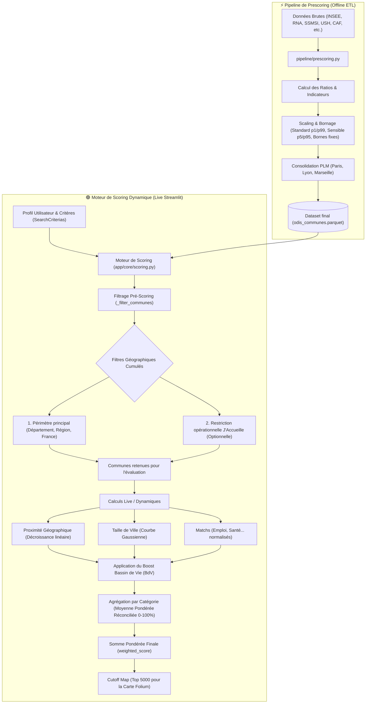

# ⚙️ Logique de Scoring ODIS (Recherche Inversée)

Ce document détaille le fonctionnement interne du moteur de scoring de l'application ODIS. Contrairement aux moteurs de recherche classiques qui filtrent par critères binaires, ODIS calcule un **score de compatibilité** entre une commune et le projet de vie d'une personne.

---

## 🏗️ L'Architecture du Score

### Flux Global du Score (Pre-scoring vs Live-scoring)

Le flux de données et de calculs se décompose entre la phase de préparation offline (ETL) et la phase d'évaluation live (Streamlit) :

Le score final d'une commune est le résultat d'un processus en sept étapes :

### 1. Filtrage Pré-Scoring (`_filter_communes`)

Avant de lancer les calculs géométriques et indicateurs de scoring (très coûteux en performance), ODIS restreint la liste des communes évaluées :

* **Périmètre Géographique Principal** : Filtrage selon le choix de l'utilisateur (Département spécifique, Région, ou France métropolitaine).
* **Filtre Opérationnel J'Accueille** : Si l'utilisateur appartient à l'organisation `jaccueille` et active le filtre de restriction opérationnelle (`org_strategic_locations_filter` à `True`), les communes sont filtrées selon un double critère géographique :
  * **Maille Bassin de Vie** : Le bassin de vie de la commune doit compter au moins un contact accueillant actif (base contacts) OU au moins un prospect inscrit (base prospects).
  * **Maille Département** : Le département de la commune doit figurer dans la liste des zones stratégiques actives configurées/sélectionnées par l'organisation (présence de coordinateurs locaux).
  * *Calcul* : Un **Inner Join** (intersection) de ces deux mailles détermine la liste des bassins de vie opérationnels éligibles. Seules les communes situées dans ces bassins de vie sont conservées.
  * *Exception* : La commune actuelle de l'usager et la commune pressentie de comparaison sont systématiquement exemptées de ce filtrage pour garantir leur évaluation et comparaison dans les résultats.

### 2. Proximité Géographique (Distance)

Pour les communes retenues à l'étape 1, un score de distance est calculé par rapport à la localisation actuelle de l'utilisateur :

- On utilise une **décroissance linéaire** : plus la commune est proche, plus le score est élevé ($Score = 1 - \frac{distance}{distance\_max}$).
- Par défaut, la recherche est optimisée dans un rayon de 50km (ajustable via les bornes de configuration).

### 3. Le Score de Taille (Fonction Gaussienne)

ODIS ne filtre pas par "nombre d'habitants" minimum. Il utilise une **courbe de Gauss** pour favoriser les villes moyennes (l'idéal d'accueil).

- **Moyenne ($\mu$)** : 50 000 habitants.
- **Écart-type ($\sigma$)** : 25 000 habitants (`DEFAULT_SIGMA`).
- Cela signifie qu'une ville de 50 000 habitants obtiendra un score de 1.0, tandis qu'une métropole géante ou un petit village obtiendront des scores plus faibles.

### 4. L'Enrichissement par le Bassin de Vie (Boost Opportunity) 🚀

C'est le cœur de l'innovation ODIS. On considère qu'une commune n'est pas une île : elle bénéficie des services de son **Bassin de Vie**.

Pour chaque critère (Emploi, Santé, Éducation), nous appliquons une logique de **Boost non-pénalisant** :

- **Formule** : $Score = S_{commune} + (1 - S_{commune}) \times (S_{BassinDeVie} \times factor)$
- **Avantages** :
  - **Jamais pénalisant** : Si le bassin de vie est pauvre en services, le score local n'est pas impacté.
  - **Bonus de proximité** : Si des opportunités existent à proximité, elles viennent combler le "manque" local.
  - **Factor** : Chaque critère a un facteur de pondération (ex: 0.5 pour l'emploi, 0.8 pour les formations) qui réduit le poids du Bassin de Vie s'il est jugé plus éloigné.

### 5. Le Pattern "Baseline Criteria" (Mandatory Metrics) 🛡️

Depuis 2026, ODIS intègre des **critères de référence (Baselines)**. Contrairement aux critères classiques qui s'activent selon les besoins de l'utilisateur, les Baselines sont **systématiquement actives** et contribuent au score global avec des poids fixes.

- **Objectif** : Garantir qu'un standard minimum de qualité territoriale (sécurité, accès aux soins, mobilité durable) soit évalué pour chaque dossier.
- **Visibilité** : Ces critères sont visibles dans les rapports détaillés et utilisés par l'IA pour justifier ses recommandations.

### 6. Normalisation des Scores par Catégorie (Percentile Ranking) 📊

Depuis mai 2026, afin de résoudre le problème des disparités d'écarts de scores entre les catégories (par exemple, la catégorie Logement qui avait historiquement des scores bruts faibles, tandis que la Santé ou l'Éducation avaient des scores très élevés, créant un biais de pondération implicite), ODIS applique une **normalisation par centiles (percentile ranking)** au niveau de chaque catégorie :

- **Principe** : Les scores bruts agrégés d'une catégorie pour toutes les communes qualifiées sont convertis en rangs centiles uniformes dans l'intervalle $[0, 1]$.
- **Protection Zéro Absolu** : Les communes obtenant un score brut de exactement `0.0` (aucun indicateur actif rencontré) sont exclues de l'opération de classement et restent fixées à `0.0` pour éviter une inflation artificielle.
- **Protection Variance Nulle** : Si toutes les communes qualifiées obtiennent le même score de catégorie (cas de recherche sur un ensemble minuscule ou mocké), le classement est ignoré et le score brut uniforme est conservé.
- **Résultat** : Toutes les catégories actives ont désormais une distribution uniforme centrée autour de 0.5. Les coefficients de pondération (ex: Famille, Économique) choisis par l'utilisateur sont ainsi parfaitement respectés.

### 7. Agrégation et Pondération

Voici l'intégralité des **57 critères** configurés dans le moteur de scoring OD&IS (`scores_config.yaml` + Distance & Taille).

### 🏠 Logement (17 critères)

| Critère                       | ID YAML | Calcul | Poids | Baseline | Boost BdV | Description |
| :---------------------------- | :------ | :----- | :---- | :------- | :-------- | :---------- |
| **Vacance Structurelle**      | `log_vac_scaled` | Pre-scoring | 1.0 | Non | 0.0 | Taux de vacance (> 2 ans) sur le parc total. |
| **Logements Sociaux Vacants** | `log_soc_inoc_scaled` | Pre-scoring | 3.0 | Non | 0.0 | Taux de logements sociaux inoccupés. |
| **Sous-occupation**           | `log_occup_scaled` | Pre-scoring | 1.0 | Non | 0.0 | Part des logements sous-occupés (potentiel d'accueil). |
| **Loyer Moyen (Tous Appt)**   | `log_loyer_moyen_appt_all_scaled` | Pre-scoring | 5.0 | Non | 0.0 | Loyer moyen d'annonce au m² (Ensemble appartements). |
| **Loyer Moyen (T1/T2)**       | `log_loyer_moyen_appt_t1_t2_scaled` | Pre-scoring | 5.0 | Non | 0.0 | Loyer spécifiquement pour petits appartements. |
| **Loyer Moyen (T3+)**         | `log_loyer_moyen_appt_t3_p_scaled` | Pre-scoring | 5.0 | Non | 0.0 | Loyer spécifiquement pour grands appartements. |
| **Loyer Moyen (Maisons)**     | `log_loyer_moyen_house_all_scaled` | Pre-scoring | 5.0 | Non | 0.0 | Loyer moyen d'annonce pour les maisons. |
| **Délai Logement Social**     | `log_soc_delay_scaled` | Pre-scoring | 5.0 | **Oui** | 0.0 | Délai moyen d'attente (Demande/Attribution, USH). |
| **Location IML (Solibail)**   | `heb_loc_iml_scaled` | Pre-scoring | 1.0 | Non | 0.8 | Intermédiation locative / Solibail. |
| **Centres CHRS**              | `heb_chrs_scaled` | Pre-scoring | 2.0 | Non | 0.5 | Capacité en CHRS. |
| **Centres CPH**               | `heb_cph_scaled` | Pre-scoring | 2.0 | Non | 0.5 | Capacité en CPH (Centre Provisoire d'Hébergement). |
| **Centres CADA**              | `heb_cada_scaled` | Pre-scoring | 2.0 | Non | 0.5 | Capacité en CADA. |
| **Foyers FJT**                | `heb_fjt_scaled` | Pre-scoring | 2.0 | Non | 0.5 | Foyers de Jeunes Travailleurs. |
| **Pensions de Famille**       | `heb_pension_scaled` | Pre-scoring | 2.0 | Non | 0.5 | Pensions de famille et maisons relais. |
| **Hébergement Citoyen**       | `heb_asso_habitant_scaled` | Pre-scoring | 2.0 | Non | 0.8 | Associations d'accueil chez l'habitant. |
| **Accueillants J'Accueille**  | `heb_jaccueille_accueillants_score` | Pre-scoring | 3.0 | Non | 1.0 | Présence active d'accueillants (Bassin de Vie). |
| **Prospects J'Accueille**     | `heb_jaccueille_prospects_score` | Pre-scoring | 2.0 | Non | 1.0 | Présence active de prospects (Bassin de Vie). |

### 💼 Emploi & Formation (9 critères)

| Critère                       | ID YAML | Calcul | Poids | Baseline | Boost BdV | Description |
| :---------------------------- | :------ | :----- | :---- | :------- | :-------- | :---------- |
| **Opportunités Emploi (A1)**  | `met_match_adult1_scaled` | Live-scoring | 3.0 | Non | 0.5 | Match direct métiers Adulte 1 (FT). |
| **Tension recrutement (A1)**  | `met_match_adult1_tension_scaled` | Live-scoring | 1.0 | Non | 0.0 | Métiers en tension Adulte 1. |
| **Opportunités Emploi (A2)**  | `met_match_adult2_scaled` | Live-scoring | 3.0 | Non | 0.5 | Match direct métiers Adulte 2 (FT). |
| **Tension recrutement (A2)**  | `met_match_adult2_tension_scaled` | Live-scoring | 1.0 | Non | 0.0 | Métiers en tension Adulte 2. |
| **Offres SIAE (A1)**          | `met_siae_match_adult1_scaled` | Live-scoring | 3.0 | Non | 0.5 | Insertion (SIAE) Adulte 1. |
| **Offres SIAE (A2)**          | `met_siae_match_adult2_scaled` | Live-scoring | 3.0 | Non | 0.5 | Insertion (SIAE) Adulte 2. |
| **Centres de Formation (A1)** | `form_match_adult1_scaled` | Live-scoring | 2.0 | Non | 0.8 | Formations recherchées Adulte 1. |
| **Centres de Formation (A2)** | `form_match_adult2_scaled` | Live-scoring | 2.0 | Non | 0.8 | Formations recherchées Adulte 2. |
| **Dynamisme Pop. Active**     | `workclass_decline_scaled` | Pre-scoring | 3.0 | **Oui** | 0.0 | Évolution de la population active (Insee). |

### 🤝 Inclusion & Lien Social (5 critères)

| Critère                     | ID YAML | Calcul | Poids | Baseline | Boost BdV | Description |
| :-------------------------- | :------ | :----- | :---- | :------- | :-------- | :---------- |
| **Lien Social (Général)**   | `inc_asso_core_scaled` | Pre-scoring | 1.0 | **Oui** | 0.8 | Densité associative globale (RNA). |
| **Accompagnement Réfugiés** | `inc_asso_refug_scaled` | Pre-scoring | 1.0 | **Oui** | 0.8 | Associations spécialisées (RNA). |
| **SIAE (Densité)**          | `inc_siae_density_scaled` | Pre-scoring | 1.0 | **Oui** | 0.8 | Densité de structures d'insertion. |
| **Affinités (Thématiques)** | `inc_asso_add_scaled` | Live-scoring | 1.0 | Non | 0.8 | Assos correspondant aux loisirs/intérêts. |
| **Services Inclusion**      | `inc_services_incl_scaled` | Live-scoring | 1.0 | Non | 0.8 | Match avec les services sélectionnés. |

### 🗺️ Territoire (6 critères)

| Critère                | ID YAML | Calcul | Poids | Baseline | Boost BdV | Description |
| :--------------------- | :------ | :----- | :---- | :------- | :-------- | :---------- |
| **Population Commune** | `ter_population_scaled` | Live-scoring | 5.0 | **Oui** | -0.8 | Score basé sur la taille de ville (Gauss). |
| **Sécurité (Indice)**  | `ter_insecurite_scaled` | Pre-scoring | 1.0 | **Oui** | 0.5 | Indice de sécurité (SSMSI). |
| **Couleur Politique**  | `ter_pol_scaled` | Pre-scoring | 1.0 | **Oui** | 0.0 | 0.0 si extrême droite, 1.0 sinon. |
| **Zone Stratégique**   | `ter_strategic_locations_scaled` | Live-scoring | 3.0 | Non | 0.0 | Zone d'action privilégiée partenaire. |
| **Adhésion ANVITA**    | `ter_anvita_scaled` | Pre-scoring | 3.0 | **Oui** | 0.0 | Membre du réseau ANVITA. |
| **Signataire CTAI**    | `ter_ctai_scaled` | Pre-scoring | 3.0 | **Oui** | 0.0 | Signataire d'un CTAI. |

### 🎓 Éducation (7 critères)

| Critère                    | ID YAML | Calcul | Poids | Baseline | Boost BdV | Description |
| :------------------------- | :------ | :----- | :---- | :------- | :-------- | :---------- |
| **Petite Enfance**         | `edu_petite_enfance_scaled` | Pre-scoring | 3.0 | Non | 0.0 | Taux de couverture Crèches/Assmat (CAF). |
| **Ecole Maternelle**       | `edu_maternelle_scaled` | Live-scoring | 2.0 | Non | 0.0 | Présence d'une école maternelle. |
| **Ecole Elémentaire**      | `edu_elementaire_scaled` | Live-scoring | 2.0 | Non | 0.0 | Présence d'une école élémentaire. |
| **Collège**                | `edu_college_scaled` | Live-scoring | 1.0 | Non | 0.5 | Présence d'un collège. |
| **Lycée**                  | `edu_lycee_scaled` | Live-scoring | 1.0 | Non | 0.8 | Présence d'un lycée. |
| **Classes à risque**       | `edu_classes_ferm_scaled` | Pre-scoring | 1.0 | Non | 0.5 | Écoles avec un besoin de nouveaux élèves. |
| **Evolution Démog. Jeune** | `youth_decline_scaled` | Pre-scoring | 1.0 | Non | 0.0 | Évolution des -15 ans (2016-2022). |

### 🩺 Santé (8 critères)

| Critère                                 | ID YAML | Calcul | Poids | Baseline | Boost BdV | Description |
| :-------------------------------------- | :------ | :----- | :---- | :------- | :-------- | :---------- |
| **Accessibilité Soins (APL)**           | `sante_rdv_delay_scaled` | Pre-scoring | 2.0 | **Oui** | 0.0 | Potentiel de RDV médicaux (APL DREES). |
| **Hôpital**                             | `sante_hopital_scaled` | Pre-scoring | 2.0 | Non | 0.8 | Présence locale d'un hôpital (BPE). |
| **Maternité**                           | `sante_maternite_scaled` | Pre-scoring | 2.0 | Non | 0.25 | Présence locale d'une maternité (BPE). |
| **Soutien Psychologique**               | `sante_psy_scaled` | Pre-scoring | 2.0 | Non | 0.0 | Structures de soutien psychologique (BPE). |
| **Dialyse**                             | `sante_dialyse_scaled` | Pre-scoring | 2.0 | Non | 0.0 | Centre de dialyse (BPE). |
| **Maison de santé**                     | `sante_maison_sante_scaled` | Pre-scoring | 2.0 | Non | 0.0 | Maison de santé (BPE). |
| **Addictologie**                        | `sante_addictologie_scaled` | Pre-scoring | 2.0 | Non | 0.0 | Structures d'addictologie (BPE). |
| **Santé Maternelle et Infantile (PMI)** | `sante_pmi_scaled` | Pre-scoring | 2.0 | Non | 0.0 | Centre PMI (BPE). |

### 🧭 Mobilité (5 critères)

| Critère                | ID YAML | Calcul | Poids | Baseline | Boost BdV | Description |
| :--------------------- | :------ | :----- | :---- | :------- | :-------- | :---------- |
| **Mobilité Durable**   | `mob_dur_share_scaled` | Pre-scoring | 3.0 | **Oui** | 0.5 | Part domicile-travail sans voiture (Ecolab). |
| **Densité Transports** | `mob_trans_pub_density_scaled` | Live-scoring | 3.0 | **Oui** | 0.0 | Arrêts de transport pour 1000 hab. |
| **Gare SNCF**          | `mob_gare_scaled` | Pre-scoring | 1.0 | **Oui** | 0.0 | Présence d'une gare dans la commune. |
| **Bonus EPCI**         | `mob_epci_scaled` | Live-scoring | 1.0 | Non | 0.0 | Même agglomération que la commune actuelle. |
| **Distance Proximité** | `mob_dist_current_loc_scaled` | Live-scoring | 1.0 | Non | 0.0 | Décroissance linéaire de proximité. |

---

## ⚡ La Phase de Prescoring (Offline Pipeline)

Avant d'être utilisés dans l'application, les scores passent par une phase de **Prescoring** dans le pipeline ETL (`pipeline/prescoring.py`). Cette étape est cruciale pour la performance :

1.  **Calcul des Ratios** : Conversion des données brutes en indicateurs comparables.
    - Exemple : (Nombre de logements vacants / Parc total) → Taux de vacance.
    - Exemple : (Nombre d'associations / Population) \* 1000 → Densité associative.
2.  **Harmonisation (Scaling)** : Les données sont normalisées entre 0.0 (le moins favorable) et 1.0 (le plus favorable). Pour garantir la robustesse face aux données aberrantes (ouliers), ODIS utilise un **Scaling par Quantiles** (`get_min_max_quant`) :
    - **Cas Standard (1%)** : Par défaut, si aucune borne n'est fixée dans la configuration, le moteur utilise les quantiles **p1** et **p99** comme bornes Min/Max.
    - **Cas Sensibles (5%)** : Pour les données très dispersées comme le **Logement** (Suroccupation, Loyers) ou l'**Éducation** (Petite Enfance, Classes à risque), le filtrage est plus agressif avec les quantiles **p5** et **p95**.
    - **Bornes Fixes** : Si `min_bound` et `max_bound` sont définis dans `scores_config.yaml`, ils priment sur le calcul par quantiles. Par exemple, l'**Indice de Sécurité** (`ter_insecurite_scaled`) utilise des bornes fixes de `min_bound=0` (sécurité maximale) à `max_bound=100` (insécurité/délinquance maximale, correspondant aux 0.5% de communes les moins sûres de France) afin de ne pas artificiellement pénaliser les villes moyennes et grandes par rapport aux très petits villages ruraux.
3.  **Filtrage Qualité** : Les valeurs aberrantes extrêmes sont ainsi écrêtées (clipping) entre 0 et 1.
4.  **Consolidation des Métropoles PLM (Paris, Lyon, Marseille)** : 
    Pour éviter que les arrondissements de Paris, Lyon et Marseille apparaissent comme des communes individuelles (ce qui fausse la visualisation cartographique et l'analyse), l'ETL consolide les données au niveau de la commune parente globale (codes INSEE `75056`, `69123`, `13055`) :
    - **Somme** : Les variables en valeurs absolues (ex: nombre d'associations, capacité d'hébergement, places en crèche) sont sommées sur l'ensemble des arrondissements.
    - **Moyenne pondérée** : Les indicateurs de taux ou ratios (ex: taux de vacance, taux de couverture petite enfance, délai d'attente logement social, loyer moyen) sont moyennés en utilisant la population de chaque arrondissement comme poids.
    - **Gares SNCF** : La présence de gares majeures est explicitement assurée pour les communes parentes consolidées.
    - **Filtrage des enfants** : Tous les codes d'arrondissements individuels sont supprimés du jeu de données final (`odis_communes.parquet`) et de toutes les tables associées (CCAS, POIs, RNA, Formations) afin que les données et les fiches descriptives ne fassent référence qu'au niveau commune globale.

---

## 🩺 Santé et Mobilité : Logiques Spécifiques

### Santé

Le score de Santé est déterminé à partir de la sélection de besoins spécifiques (ex: "Hôpital", "Maternité") dans le formulaire (checkboxes) :

- Les scores de présence correspondants (`sante_hopital_scaled`, `sante_maternite_scaled`, etc.) sont précalculés de manière booléenne (présence = 1.0, absence = 0.0) et stockés au niveau de la commune dans le Parquet.
- Seuls les indicateurs sélectionnés par l'utilisateur sont activés au moment de la recherche.
- Pour chacun des indicateurs activés, le **Boost Bassin de Vie (BdV)** est appliqué selon la politique de coefficient configurée (ex: 0.8 pour un hôpital de portée régionale, 0.25 pour une maternité, et 0.0 pour les structures locales d'accès direct).
- Contrairement aux versions précédentes, il n'y a plus d'agrégation `max()` dynamique au sein d'une seule colonne de santé, ce qui permet à chaque besoin en santé d'être évalué et pondéré de manière indépendante avec son propre poids de configuration.

### Mobilité

La mobilité est évaluée sur trois axes :

- **Transports en commun** : Basé sur la densité d'arrêts (GTFS) par habitant.
- **Accès Ferroviaire** : Bonus pour la présence d'une gare SNCF dans la commune.
- **Proximité (Distance Decay)** : Utilisation de la décroissance linéaire par rapport au point de départ.
- **Bonus EPCI** : Un bonus est accordé si la commune appartient à la même intercommunalité que la ville actuelle, favorisant les déplacements au sein d'un même bassin d'emploi.

---

## ⚡ Limitations de Performance (Map Cutoff) 🏁

Pour garantir une expérience utilisateur fluide sur la carte Folium (évitant le gel du navigateur avec des dizaines de milliers de polygones), le moteur applique une **limitation automatique** :

- **Seuil** : 5 000 communes maximum (`MAX_MAP_POLYGONS` dans `app/config.py`).
- **Logique** : Seules les 5 000 meilleures communes selon le `weighted_score` sont conservées pour l'affichage cartographique.
- **Exception** : La **commune actuelle** (départ) est systématiquement conservée dans le jeu de données, même si son score est faible, afin de servir de point de repère visuel.

> Cette optimisation permet de réduire drastiquement l'empreinte mémoire côté client tout en conservant les résultats les plus pertinents pour le projet de vie.
