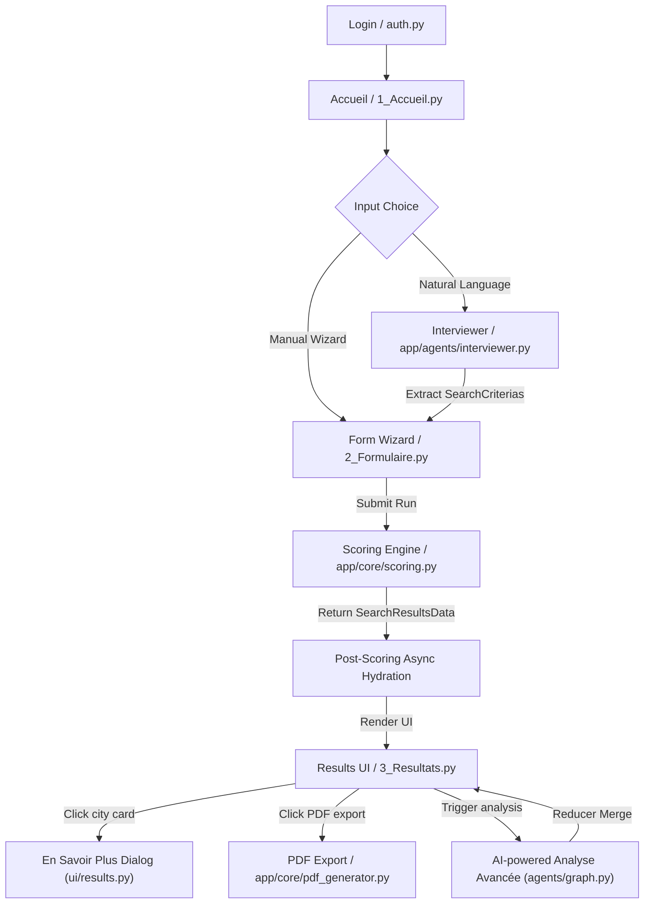

# ODIS App Architecture Guide

This document describes the design principles, runtime state lifecycle, and core feature architectures of the **ODIS Stream2 App** (`app/`). It serves as an onboarding guide and technical blueprint for software engineers building, debugging, or extending the ODIS runtime.

---

## 🗺️ Architectural Context

*   For the high-level macro-architecture and project overview, see **[PROJECT_ARCHITECTURE.md](file:///Users/jacques/dev/13_odis_stream2/PROJECT_ARCHITECTURE.md)**.
*   For the offline ETL pipelines and data loaders, see **[pipeline/PIPELINE_ARCHITECTURE.md](file:///Users/jacques/dev/13_odis_stream2/pipeline/PIPELINE_ARCHITECTURE.md)**.
*   For details on the background AI expert agents, see **[app/agents/GRAPH_ARCHITECTURE.md](file:///Users/jacques/dev/13_odis_stream2/app/agents/GRAPH_ARCHITECTURE.md)**.

---

## 1. Application Flow & Lifecycle

The Streamlit application coordinates user authentication, profiling, scoring calculations, and dynamic result rendering. 



### 1.5 Authentification & Organization Profiles (ACL)

ODIS implements a secure, role-based organizational profile context enforced immediately upon app startup.

1.  **Security Gate (`app/utils/auth.py`)**:
    *   Every page enters through `ui/page_shell.py`, which applies the authentication guard before rendering and centralizes telemetry, shared-link routing and standard sidebar actions.
    *   **Local Development**: By default (when Cloud Run environment variable `K_SERVICE` is not detected), the app auto-logins with a fallback developer user (`jacques-local`) belonging to the `jaccueille` organization.
    *   **Forced Auth Override**: Setting `ODIS_FORCE_AUTH=True` in environment variables disables this bypass, forcing the Streamlit login screen to render even during local development.
    *   **Production Authentication (Hybrid)**: On Cloud Run, users can authenticate via two methods presented side-by-side:
        *   **OpenID Connect (OIDC / Google Workspace)**: Uses Streamlit's native `st.login("google")` / `st.user` to authenticate an identity. The application then authorizes it on every page entry against the fail-closed `OIDC_AUTHORIZATION_POLICY_JSON` Secret Manager secret. Its strict JSON contract maps `allowed_domains` and `allowed_emails` directly to an existing static Organization profile. An unknown identity, malformed policy, or unknown organization is denied; there is no generic/default organization fallback.
        *   **Legacy Credentials**: Checked against the `ODIS_USERS_CONFIG` JSON environment variable or Streamlit secrets:
            ```json
            {
              "users": {
                "user@domaine.fr": {
                  "password_hash": "pbkdf2_sha256$20000$...",
                  "org_id": "myorg"
                }
              }
            }
            ```
            Passwords are verified using timing-safe `PBKDF2-HMAC-SHA256` password hashing.

2.  **Organization Defaults & Smart Merge (`app/utils/data_loader.py`)**:
    *   Upon successful authentication, the active user context is stored as a Pydantic `User` model, and their organization context is loaded from `config.ORGANIZATION_PROFILES` as a Pydantic `Org` model in `st.session_state['org']`.
    *   During state initialization (`ensure_data_initialized`), `apply_logged_in_org_defaults()` merges organization settings into the session defaults:
        *   **Strategic Zones**: Binds default search zones (`org_strategic_locations`) and target geographic resolution (`org_strategic_locations_type`).
        *   **Lists**: Performs a Union of default arrays (e.g. adding partner-specific housing lists to global defaults).
        *   **Scalars**: Performs a direct override of scalars (e.g. strategic weight boosts take precedence).
    *   **Toast Gating**: Gated in session state via `org_defaults_applied` to ensure the activation notification toast is only displayed once per login/session.
3.  **Explicit data lifecycle and asynchronous preload (`app/utils/data_loader.py`)**:
    *   The home page initializes only Streamlit form state and starts a non-blocking preload. It makes no synchronous GCS data read. The preload obtains the active release and prepares the complete bundle without writing Streamlit session state or changing visible content.
    *   A `ReleaseContext` reads `current.json` and the checksummed manifest once, freezes the release ID, then fetches missing runtime Parquets into the versioned `/tmp` cache with bounded parallelism. Every downloaded file is checked against the manifest checksum before Pandas reads it. Coverage artifacts remain pipeline-only and are never part of this bundle.
    *   `2_Formulaire.py` explicitly requests one complete `app_data` bundle before rendering its controls. The controls in `ui/forms.py` receive that bundle as an argument; they do not independently fetch datasets. This keeps their ordering/filtering metrics (ROME job counts, WALDEC association counts, prospective-city population) available and consistent.
    *   `3_Resultats.py` likewise owns one complete bundle for a live search. An immutable shared-result snapshot is self-contained and reads no data release until the user chooses to edit or recompute it. A cold cache only delays the page that actually needs the complete data, while a preloaded cache makes that request immediate.

### 1.6 Page shell, loading path and session ownership

| Entry/page | Page-load data | Post-load work | State owner |
| --- | --- | --- | --- |
| `main.py` | No data bundle | Authenticated shared-link routing, then redirect to Accueil; starts an asynchronous complete-bundle preload | `page_shell` + `FormState` defaults |
| `1_Accueil.py` | No data bundle | Optional interviewer/auto-detection; confirmed criteria hydrate form widgets before navigation | `FormState` |
| `2_Formulaire.py` | Complete bundle, without RAG initialization | Interactive wizard only; individual controls never fetch data | Streamlit widget keys through `FormState` |
| `3_Resultats.py` | Complete bundle for a live run/edit; none for immutable shared display | `SearchController` runs deterministic scoring, publishes results, then launches optional post-scoring work | `AppSession` + `SearchController` |
| `4_Analytics.py` | No ODIS scoring bundle | BigQuery analytics query after admin authorization | Page-local filters/cache |

`ui/page_shell.py` owns the common entry convention. `ui/form_state.py` owns the translation between native widget keys and an immutable `SearchCriterias`. `services/app_session.py` owns active-search/reset transitions, while `services/search_controller.py` is the only normal deterministic execution path.

---

## 2. Core Data Models (`app/core/models.py`)

ODIS operates on a strict **Model-First** architecture. The entire state of a user's session and identity is encapsulated in five primary Pydantic models.

### 2.1 `SearchCriterias`
This model represents the user's situation and preferences. All UI inputs and agent context structures stem from this object.
- **Geographic Scope**: `commune_actuelle` (reference location) and `commune_pressentie` (shortlisted city) are strongly-typed as `CriteriaItem` (paired Code-Label objects) to avoid string mismatch bugs.
- **Parameters**: Captures family size, schools (`classe_enfants`), target jobs (`codes_metiers`), and target training (`codes_formations`).
- **Pondération Config**: Holds customized weights (`criteria_weights` and global multipliers like `poids_emploi`, `poids_logement`).
- **Fail-Safe Validator (`fix_stringified_items`)**: A `@model_validator(mode='before')` that captures and parses stringified schemas (e.g. LLM-escaped objects) back into typed `CriteriaItem` dicts dynamically.
- **Change Detection (`compute_hash`)**: Generates an MD5 hash of all input values (excluding the AI summary). This is used by the caching engine to skip calculations if the criteria haven't changed.

### 2.2 `CommuneResult`
Represents the complete scoring details and qualitative output for a single commune.
- **Identifiers**: Holds `codgeo` (INSEE code), `name`, `population`, and `codgeo_bdv` (Bassin de Vie code).
- **Sub-Metric Containers**: Contains typed child models for each category:
  - `employment`: `EmploymentMetrics` (offers count, tension list, matching training).
  - `housing`: `HousingMetrics` (J'Accueille hosts count, rent price per m², social delay).
  - `education`: `EducationMetrics` (facility counts and listings by type).
  - `health`: `HealthMetrics` (APL access indexes, medical centers list).
  - `inclusion`: `InclusionMetrics` (refugee associations, local solidarity networks).
  - `mobility`: `MobilityMetrics` (transit stop densities, EPCI boundary checks).
  - `territoire`: `TerritoryMetrics` (strategic zone boost tags, insecurity indexes).
- **AI Content**: Holds the `refiner_pitch` (refinement narrative), `expert_analysis` (raw expert agent markdowns), and `odis_synthesis` (conversational history payload).

### 2.3 `SearchResultsData`
The parent wrapper containing the global session results.
- `search_hash`: The criteria MD5 hash used for execution validation.
- `results`: List of the top-N recommended `CommuneResult` objects sorted in descending order of `global_score`.
- `current_geo`: Reference `CommuneResult` for the user's starting city.
- `commune_pressentie`: Optional comparison `CommuneResult` for the user's shortlisted city.
- `get_by_code(codgeo)`: Centralized lookup helper that searches across recommendations, current geo, and the pressentie city to prevent index errors.

### 2.4 `Org`
Represents a partner organization's identity, default targets, and custom scoring profile.
- **Identity & Resolution**: Holds unique `id` and descriptive metadata.
- **Targets**: Holds `zone_type` (e.g., `departement`) and list of target strategic codes `default_zones`.
- **Defaults**: Holds unstructured key-value dictionary `defaults` merged into the starting session state.
- **AI Free Mode flag**: Controls whether the organization is restricted to AI-free fallback executions.

### 2.5 `User`
Encapsulates a logged-in user profile.
- **Identity**: Holds the `username` (usually email address).
- **Membership**: Ties the user to an organization profile via `org_id`.


---

## 3. UI-Agent Integration & State Synchronization

Streamlit operates on a linear execution model, re-running the entire script upon user interaction. To run heavy computations or interface with external LLMs without blocking the UI, ODIS decouples execution using background threads and in-memory caches.

### 3.1 AI Agent Involvement Use Cases
AI agents are utilized strictly for dynamic parameter translation and qualitative city enrichment:
1.  **Auto-Detection (Form Pre-Population)**: Before entering the wizard, the Interviewer agent (`app/agents/interviewer.py`) parses natural language descriptions of a user's situation and extracts criteria into a structured `SearchCriterias` object, pre-filling the form.
2.  **On-Demand Qualitative Enrichment**: When a user is viewing the scored recommendations list and expands a city's details, they can trigger a **"Full AI Analysis"**. This launches the parallel multi-agent graph swarm (`app/agents/graph.py`) to gather web and RAG context and compile a targeted city briefing.

### 3.2 UI Synchronization Lifecycle
When initiating long-running scoring or AI swarm tasks:
1.  The UI spawns a background thread via [launch_background_city_analysis](file:///Users/jacques/dev/13_odis_stream2/app/agents/utils.py#L130).
2.  The UI displays a loading widget inside a `@st.fragment(run_every=2.0)` polling component.
3.  The thread writes state updates to the session-specific `st.session_state['odis_bg_store']`.
4.  Once the status changes to `"done"`, the UI triggers a page rerun to render the new state.

Form widget state is intentionally not wrapped in a second reactive store. Each widget has one native `ui_*` Session State value. `FormState.hydrate()` applies defaults, organization/demo profiles, auto-detection and shared criteria before widgets render; `FormState.collect()` is the sole conversion to `SearchCriterias`. Composite mirrors such as checkbox-list copies, expert flags and organization boost dictionaries are derived instead of persisted.

### 3.3 The State Reducer Pattern
Because background threads and the `pydantic-graph` swarm run outside the main Streamlit thread, ODIS implements a **state reducer pattern** (`merge_search_results` in `app/agents/state.py`) to update the UI:
- Upon background thread completion, the reducer intercepts the newly generated `expert_analysis` and `refiner_pitch` payloads.
- It matches the target city within `st.session_state.search_results` (using the INSEE `codgeo` or normalized name).
- It merges the qualitative fields into the active `CommuneResult` in-place, triggering a clean reactive UI refresh.

### 3.4 AI-Free Fallback Mode
ODIS implements a degraded execution mode ("AI-free" mode) where all Vertex AI / Gemini LLM interactions are completely bypassed.
- **Activation**: Enabled globally when the environment variable `ODIS_AI_FREE_MODE=True` (or `1`, `yes`) is set, or session-specifically when the active organization profile in `ORGANIZATION_PROFILES` has `"ai_free_mode": True`. Checked using the `is_ai_free_mode()` utility in `app/config.py`.
- **UI Impacts**:
  - **Accueil Page**: Completely hides the "Auto Détection" option column and renders a single full-width "Entretien Classique" card.
  - **Results Page**: Hides the "Analyse Avancée" button. (Note: The "Résumé de la situation" expander has been completely removed from the results page).
- **Pipeline & Integration Fallbacks**:
  - **Post-Scoring**: Bypasses launching the background refiner agent. Instead, it immediately generates a static pitch showing the top 3 contributing score indicators sorted by their relative weight contribution (`score_normalise * relative_weight`) and updates the state cache with `status_refiner = "done"`.
  - **Job Curation**: Bypasses the LLM curator agent and returns the top 10 raw France Travail job offers directly (sorted by distance).
  - **RAG Lookup**: BigQuery-based SQL lookups for local associations ("the RAG piece") remain active as they do not require LLMs.

---

## 4. Key App Components

### 4.1 Search Criteria Form Wizard (`app/pages/2_Formulaire.py` & `app/ui/forms.py`)
A multi-step, interactive wizard that guides the user through profiling a beneficiary's situation. Widgets retain native Streamlit keys; `app/ui/form_state.py` is the single hydration/collection adapter to the `SearchCriterias` Pydantic model.

### 4.2 Scoring Engine (`app/core/scoring.py`)
The mathematical engine of the application. It receives the verified GCS release bundle and calculates normalized, weighted compatibility scores across all 36,000+ French communes.
- Performs quantile normalizations to eliminate outliers.
- Applies centile ranking to categories to enforce balanced weights.
- Evaluates mandatory baseline criteria and incorporates regional boosts.
- Details are documented in [SCORING.md](file:///Users/jacques/dev/13_odis_stream2/SCORING.md).

### 4.3 Post-Scoring Hydration (`app/core/postscoring.py`)
An asynchronous service that runs immediately after scoring. It queries external APIs (France Travail for live jobs, Les emplois de l'inclusion for solidarity structures) and runs database-level RAG searches for associations in BigQuery, packing the returned records into the `CommuneResult` model.

### 4.4 Results UI & "En Savoir Plus" Pane (`app/pages/3_Resultats.py` & `app/ui/results.py`)
Renders the final sorted list of candidate communes.
- Displays comparative metric cards and charts.
- Outlines the **"En Savoir Plus" Pane**: An expandable detail container that shows detailed sub-metrics for the focus city, lists local healthcare/education facilities, displays matching job offers, and hosts the trigger to launch the AI analysis.

### 4.5 Full AI Analysis Swarm (`app/agents/graph.py`)
The background MapReduce pipeline built on `pydantic-graph`. When triggered from the "En Savoir Plus" pane, it coordinates 6 domain expert agents to query Brave Search and internal RAG tables to produce the qualitative briefing text. Details are documented in [app/agents/GRAPH_ARCHITECTURE.md](file:///Users/jacques/dev/13_odis_stream2/app/agents/GRAPH_ARCHITECTURE.md).

### 4.6 Dynamic Folium Map (`app/core/maps.py`)
Decodes commune boundary geometries from **WKB (Well-Known Binary)** bytes just-in-time and overlays interactive markers and color-coded polygons onto a Leaflet-based map, indicating recommendations and comparison cities.

### 4.7 PDF Report Export (`app/core/pdf_generator.py`)
Generates structured, multi-page PDF briefings for social workers. It dynamically converts Markdown summaries into ReportLab Paragraph flowables, rendering tables and page counts.

### 4.8 BigQuery Telemetry, Data Manifest & In-App Admin Dashboard (`app/services/telemetry.py`, `app/ui/sources_dialog.py` & `app/pages/4_Analytics.py`)
Coordinates application usage tracking, data versioning transparency, and internal business intelligence:
- **`search_events`**: Consolidated search events in BigQuery containing `interaction_id`, `timestamp`, `username`, `org_id`, `manifest_version` (referencing `data_manifest.json`), `search_hash`, criteria (dynamically extracted from `SearchCriterias.model_fields` and mapped against ACL `odis_visibility` tags), weights, and recommended cities.
- **`usage_events`**: Functional event logging for page navigation (`page_view` with `origin` tracking) and key user interactions (`view_commune_details`, `run_ia_analysis`, `auto_detect_criteria`, `export_pdf`).
- **Data Manifest Dialog (`app/ui/sources_dialog.py`)**: Accessible from the sidebar on all pages (`ℹ️ Sources des données`), rendering an interactive `@st.dialog` modal displaying the active Data Manifest version, compilation date, and formatted catalog of all 36+ data sources (Odace Silver, Data.gouv.fr, Data Inclusion) with reference years, freshness, and documentation links.
- **`4_Analytics.py`**: Restricted admin BI dashboard guarded by `auth.is_admin()`. Queries BigQuery with REST fallback (`create_bqstorage_client=False`) to deliver activity KPIs, recommendation popularity metrics, and search profile analytics across 3 interactive tabs.


---

## 5. Directory Structure & Extension Guide

### 5.1 Directory Layout
```text
app/
├── core/
│   ├── models.py         # Core Pydantic models (data contracts)
│   ├── scoring.py        # Core Pandas scoring and normalization engine
│   ├── maps.py           # Folium rendering and geometry decoding
│   └── pdf_generator.py  # ReportLab document layout builder
├── ui/
│   ├── components.py     # UI cards, tables, admin sidebar links, and metric displays
│   ├── form_state.py      # Native widget-state hydration and criteria collection
│   ├── forms.py          # Form input wizard layout fields
│   ├── page_shell.py      # Common auth, routing, telemetry, and sidebar conventions
│   ├── results.py        # Polling fragments and detail views
│   └── idle_sleep.py     # Iframe activity listeners & idle monitors
├── pages/
│   ├── 1_Accueil.py      # Entry screen
│   ├── 2_Formulaire.py   # Multi-step search wizard
│   ├── 3_Resultats.py    # Map, rankings list, and chatbot page
│   └── 4_Analytics.py    # Admin BI analytics dashboard
├── services/
│   ├── app_session.py     # Identity/resource-preserving search state transitions
│   ├── search_controller.py # Deterministic execution and result publication
│   ├── share_service.py  # Snapshot persistence, GCS upload, and session restoration
│   ├── telemetry.py      # BigQuery search & usage events logger
│   └── bq_logger.py      # Agent state and chat trajectory BigQuery logger
├── utils/
│   ├── auth.py           # Password gates, admin whitelist checks, and idle monitor triggers
│   └── data_loader.py    # Lazy-loaded data singletons
└── config.py             # Global constants, admin whitelist, and options catalogs
```

### 5.2 Guidelines for Future Developers

#### Adding a New Scoring Indicator
1.  **ETL Integration**: Add the raw source configuration to `pipeline/sources.yaml` and update `pipeline/ingest.py`/`build.py` to cache the clean metrics in `Clean Parquets`.
2.  **Config Registration**: Add the indicator name, internal ID, normalization bounds (quantiles), and default weights to [scores_config.yaml](file:///Users/jacques/dev/13_odis_stream2/app/scores_config.yaml).
3.  **Engine Update**: Update `ScoringEngine._compute_scores` in `app/core/scoring.py` to process the new indicator column.
4.  **Model Registration**: Add the target metric field to the corresponding sub-metric class (e.g., `HousingMetrics` in [models.py](file:///Users/jacques/dev/13_odis_stream2/app/core/models.py)) with appropriate `odis_visibility` tags.

#### Adding a New UI Page
1.  Add the page file under `app/pages/` (following Streamlit's numeric naming convention: `X_Name.py`).
2.  Call `st.set_page_config()` first, then `page_shell.enter_page()` with the page telemetry name and any admin/shared-link policy.
3.  Use `page_shell` sidebar primitives and feature-specific components from `app/ui/components.py`.

#### Adding an AI Agent Skill Card
1.  Create a new Markdown file with YAML frontmatter under `app/agents/skills/`.
2.  Define the `domain` (e.g., `mobility_expert`), `id`, and specific constraints.
3.  Update the coordinator `ts_agent.py` prompts to plan and select the new skill card ID under appropriate user criteria conditions.

---

## 6. Search Results Permalinks & Sharing (`share_service.py`)

ODIS supports sharing search results via unique permalink URLs (`?search=<share_id>`).

### 6.1 Data Persistence Architecture
* **On-Demand Snapshotting**: Clicking "Partager la recherche" serializes the active `SearchCriterias` and `SearchResultsData` Pydantic models.
* **Storage Location**: Saved as a gzipped JSON blob to Google Cloud Storage (`gs://odis-stream2-eu/searches/<share_id>.json`). Local-disk persistence is not supported.
* **Telemetry**: Logs a `search_shared` event to BigQuery `odis_logs.usage_events`.

### 6.2 URL Parameter Interception & Session Hydration
* **URL Parameter Interception**: the relevant entry scripts call `page_shell.enter_page()`; the query parsing, authentication ordering and redirect policy live in one helper.
* **Session State Restoration**: `restore_shared_search_to_session_state()` re-hydrates `st.session_state` with:
  * `config` (`SearchCriterias`) and `search_results` (`SearchResultsData`).
  * the saved scored map context and view.
  * immutable snapshot metadata through `AppSession.restore_snapshot()`.
  * No engine or fabricated background-task completion is created for a snapshot.
* **Fork on Edit**: Fine-tuning search criteria and re-running a search from a permalink generates a fresh `share_id` snapshot without altering the original sender's permalink.
