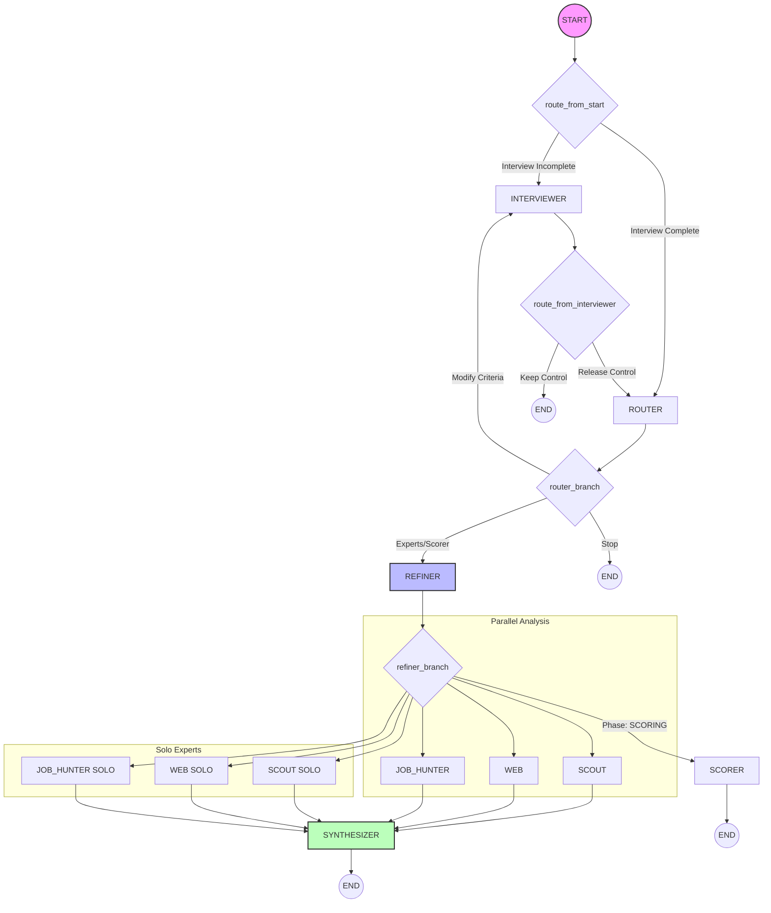

# ODIS Agent Architecture (v4.1)

This document defines the authoritative architecture and design patterns for the ODIS multi-agent system. **AI Agents MUST NOT "simplify" or refactor these patterns without explicit authorization**, as many are designed to handle specific production edge cases (latency, token limits, and async loop stability).

## 🏗️ Graph Topology

The ODIS system uses LangGraph to orchestrate a sophisticated conversation flow divided into three main phases: **DISCOVERY**, **SCORING**, and **ANALYSIS**.

### 🧠 Authority Split & Orchestration

1.  **Router Authority**: The `ROUTER` is the brain of the flow. It extracts `focus_city` and determines the `execution_mode` (`full_analysis` vs `specific_ask`).
2.  **Refiner Context**: The `REFINER` is a dedicated summarizer. It maintains the `odis_brief` (dossier) so that expert agents don't have to read the entire chat history, saving tokens and improving reasoning focus.
3.  **Router Bypass (SOTA)**: For speed, the `START` node bypasses the Router and goes directly to the `INTERVIEWER` if the interview is still active.

---

## 💾 State Management & Reducers

The `ODISGraphState` is the global source of truth. It uses sophisticated **reducers** (annotated via `operator.add` or custom functions) to merge data across parallel branches.

### 🔑 Criteria Hashing (MD5)

- Every time `search_criteria` changes, a new `criteria_hash` is computed.
- Expert nodes check this hash against the existing `search_results`.
- **Cache-First Pattern**: In `full_analysis` mode, experts skip their LLM call if the `criteria_hash` matches existing results.

### 🧩 Results Merging (Robust Reducer)

The `merge_search_results` reducer in `state.py` is critical:

- It matches expert results to existing cities using `codgeo` (primary) or normalized name (fallback).
- It prevents the creation of "Skeleton Results" (partial data without population/scores).
- **WARNING**: Do not simplify this reducer; it handles the complex fan-in from parallel experts.

---

## ⚡ Technical Guardrails (Production Hardening)

### 📄 Synthesizer "Raw String" Strategy

- **Pattern**: Unlike other agents that return Pydantic models, the **Synthesizer returns a raw `str`**.
- **Rationale**: Large Markdown responses (5k+ tokens) are prone to JSON formatting errors and truncation. Using raw strings eliminates `json.loads` failures and reduces latency for the final display.

### 🧵 Async Loop & Client Injection

- **Pattern**: `genai.Client` is instantiated inside the execution thread and injected into every PydanticAI agent via `GoogleProvider(client=deps.client)`.
- **Rationale**: Prevents the common `Event loop is closed` error in Streamlit by ensuring every agent uses a client attached to the _current_ active loop.

### 🔀 Intentional Node Duplication

- **Nodes**: `scout` vs `scout_solo`, etc.
- **Rationale**: While they share the same underlying Python function (`scout_node`), they are distinct nodes in the graph to allow for different edge logic. `scout` is part of a parallel chain that waits for siblings, while `scout_solo` is a direct-to-synthesizer path.

---

## 📝 Configuration

- **Model Standard**: All agents are standardized on `gemini-3.1-flash-lite-preview` for optimal speed/cost.
- **Usage Tracking**: Each node captures token usage, which is merged into a global `usage` object for session-level reporting.
