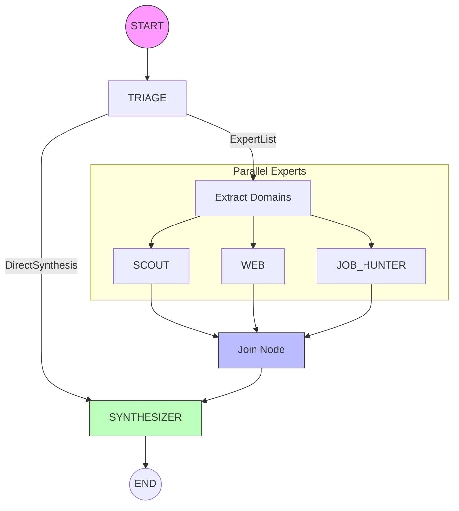

# ODIS Graph Architecture (v5.0)

This document defines the technical architecture of the ODIS multi-agent orchestration, powered by `pydantic-graph`.

## 🏗️ Pipeline Topology (MapReduce)

ODIS follows a native **MapReduce (Spreading)** pattern for high-performance territorial analysis. The graph is designed to be a unidirectional data processing pipe.

### 🧠 Core Orchestration Nodes

1.  **Triage Node**: The entry point. It uses a `RoutingResult` schema to determine if the request needs a full parallel analysis or a direct synthesis. It returns either an `ExpertList` or a `DirectSynthesis` DTO.
2.  **Extract Domains (Map)**: A standard mapping node that fans out the work by emitting a stream of domain strings.
3.  **Expert Worker**: A generic node instance that dynamically selects and runs the appropriate `PydanticAI` agent (`scout`, `web`, `job_hunter`) based on the domain input.
4.  **Join Node**: A `g.join()` node using `reduce_list_append`. It waits for all parallel experts to complete and merges their `AgentArtifacts` into a single list.
5.  **Synthesizer Node**: The final stage. It merges all expert findings into the state and generates the final user-facing Markdown response.

---

## 💾 State & Data Flow

### ⚛️ `GraphState` (Dataclass)
Unlike legacy versions, we use a pure Python `@dataclass` for state. This ensures:
- **Streamlit Stability**: Avoids `PydanticRedefinitionError` during code changes.
- **Statelessness**: The graph is instantiated and run from scratch for every request, with state passed explicitly.

### 🧩 Result Aggregation
Expert findings are encapsulated in `AgentArtifact` objects:
- `domain`: The expert name.
- `result`: Markdown content.
- `usage`: Captured token metrics.

Merging happens in the `synthesizer_step` by matching the `focus_city` codgeo in the `search_results`.

---

## ⚡ Production Patterns

### 🔀 Decision Branching (SOTA)
We use `g.decision().branch()` for clean, type-safe routing. This replaces legacy complex edge functions and ensures the graph topology is visible in the code.

### 📊 Usage Instrumentation
Every node (Triage, Expert, Synthesizer) captures `pydantic-ai` `UsageStats`. These are merged into the global state to provide accurate cost and token tracking for the session.

### 🧪 Integration Testing
The architecture is verified via:
- `test_graph_verification.py`: End-to-end execution of the full MapReduce flow.
- `test_interviewer_agent.py`: Testing the one-shot extraction logic.

---

## 📝 Configuration Standard

- **Model Mapping**: 
    - `router`: GPT-4o-mini or Gemini Flash (Fast).
    - `experts`: Gemini Flash (Multimodal/Search capability).
    - `synthesizer`: Gemini Flash (Context handling).
- **Tooling**: Experts leverage `GoogleSearchGrounding` (Web) and `BraveSearch` / `GoogleMaps` (Scout) for real-time data.
