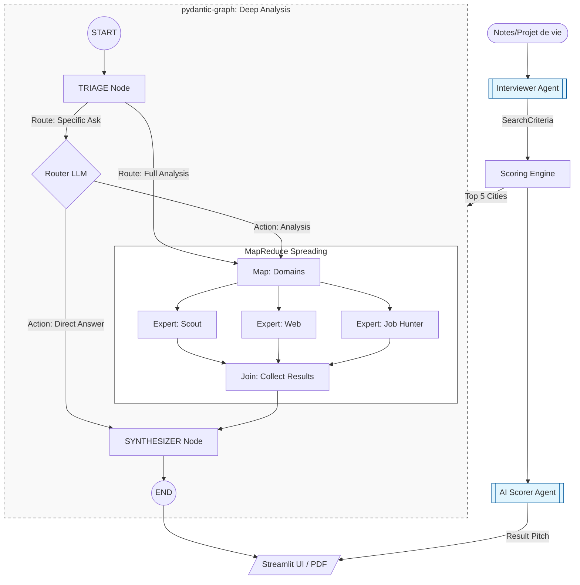

# ODIS Graph Architecture (v5.0)

This document defines the technical architecture of the ODIS multi-agent orchestration, powered by `pydantic-graph`.

## 🏗️ Pipeline Topology (MapReduce)

ODIS follows a native **MapReduce (Spreading)** pattern for high-performance territorial analysis. The graph is designed to be a unidirectional data processing pipe.

### 🧠 Core Orchestration Nodes

1.  **Triage Node (The Router)**: The entry point. 
    - **Logic**: If `execution_mode` is `full_analysis`, it automatically triggers all experts. If `specific_ask`, it calls the **Router Agent** (LLM) to analyze the user's intent.
    - **Decision**: Returns either an `ExpertList` (for parallel fan-out) or a `DirectSynthesis` DTO (if the LLM can answer using existing context).
2.  **Extract Domains (Map)**: A standard mapping node that fans out the `ExpertList` into parallel worker instances.
3.  **Expert Worker**: A generic node instance that delegates to specialized agents (`scout`, `web`, `job_hunter`).
4.  **Join Node**: A `g.join()` node that merges `AgentArtifacts` into a single list.
5.  **Synthesizer Node**: The final stage. It merges expert findings into the state and generates the final user-facing Markdown response.

---

## 🧩 Decoupled AI Components

While the `odis_graph` handles deep city analysis, other specialized tasks are decoupled for performance:

### 1. The Interviewer (One-Shot)
The legacy multi-turn Interviewer and Refiner have been replaced by a standalone **One-Shot Autodetect Agent** (`app/agents/interviewer.py`).
- **Role**: Extracts `SearchCriterias` and generates a prose **"Dossier Summary"** (Briefing) from unstructured text.
- **Flow**: Runs in the UI (`1_Accueil.py`) before the graph is even started. The resulting summary is stored in the user's project profile.

### 2. The Scorer (Post-Scoring explanation)
- **Role**: Explains the mathematical scores calculated by the `ScoringEngine`.
- **Location**: Triggered as a background task in `app/agents/utils.py` after the search is complete.
- **Why outside the graph?** Because scoring is deterministic and performed programmatically. The Scorer agent only "pitches" the results to the user.

---

## 💾 State & Data Flow

### ⚛️ `GraphState` (Dataclass)
Unlike legacy versions, we use a pure Python `@dataclass` for state. This ensures:
- **Streamlit Stability**: Avoids `PydanticRedefinitionError` during code changes.
- **Statelessness**: The graph is instantiated and run from scratch for every request, with state passed explicitly.

### 🧩 Result Aggregation
Expert findings are encapsulated in `AgentArtifact` objects:
- `domain`: The expert name.
- `result`: Markdown content.
- `usage`: Captured token metrics.

Merging happens in the `synthesizer_step` by matching the `focus_city` codgeo in the `search_results`.

---

## ⚡ Production Patterns

### 🔀 Decision Branching (SOTA)
We use `g.decision().branch()` for clean, type-safe routing. This replaces legacy complex edge functions and ensures the graph topology is visible in the code.

### 📊 Usage Instrumentation
Every node (Triage, Expert, Synthesizer) captures `pydantic-ai` `UsageStats`. These are merged into the global state to provide accurate cost and token tracking for the session.

### 🧪 Integration Testing
The architecture is verified via:
- `test_graph_verification.py`: End-to-end execution of the full MapReduce flow.
- `test_interviewer_agent.py`: Testing the one-shot extraction logic.

---

## 📝 Configuration Standard

- **Model Mapping**: 
    - `router`: GPT-4o-mini or Gemini Flash (Fast).
    - `experts`: Gemini Flash (Multimodal/Search capability).
    - `synthesizer`: Gemini Flash (Context handling).
- **Tooling**: Experts leverage `GoogleSearchGrounding` (Web) and `BraveSearch` / `GoogleMaps` (Scout) for real-time data.
