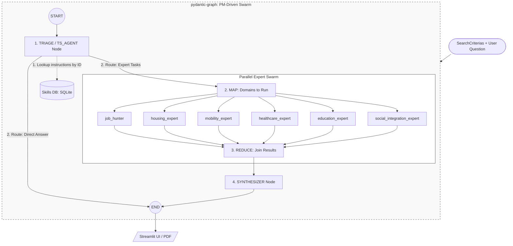

# ODIS Graph Architecture (v6.0)

This document defines the technical architecture of the ODIS multi-agent orchestration, powered by `pydantic-graph`.

## 🏗️ Pipeline Topology (PM-Driven MapReduce Swarm)

ODIS follows a PM-driven **MapReduce (Spreading)** pattern for high-performance territorial analysis. The graph is designed to process user requests via a Project Manager (`ts_agent`) triage step that plans the swarm execution.

### 🧠 Core Orchestration Nodes

1.  **Triage Node / TS_AGENT (The Project Manager)**:
    *   **Planning**: Receives the user question, search criteria, and context. Runs a fast LLM (`ts_agent`) to evaluate the dossier, identify which experts to run, formulate custom task missions for each domain, and select the relevant **Skill Cards** by ID from the database.
    *   **Decoupled Database Fetching**: In a single synchronous pass, triage connects to the SQLite `knowledge.db` to load all selected skill card instructions, storing them in `GraphState.expert_skill_instructions` to prevent concurrent database connections during parallel worker runs.
    *   **Direct Answer Bypass**: If the user's question can be answered completely using the existing context, `ts_agent` generates a `direct_answer` and the triage node returns `End(direct_answer)` immediately, completely bypassing the MapReduce swarm and the Synthesizer.
2.  **Extract Domains (Map)**: Fans out the chosen list of active domains into parallel worker nodes.
3.  **Expert Workers (6 Domain Experts)**:
    *   `job_hunter`: Finds ROME job offers (France Travail / SIAE).
    *   `housing_expert`: Evaluates rent m², housing delay, and CCAS.
    *   `mobility_expert`: Examines bus/tram networks and transit solidary pricing.
    *   `healthcare_expert`: Analyzes APL access indexes, hospitals, and PMI.
    *   `education_expert`: Lists local schools, kindergartens, and registration processes.
    *   `social_integration_expert`: Identifies refugee support associations, CCAS, and RNA resources.
    *   Each active expert runs in a **single turn** (no ReAct tool calling loops), reading its specific instructions directly from `GraphState.expert_skill_instructions` and querying its specific APIs/tools.
4.  **Join Node (Reduce)**: Accumulates `AgentArtifact` payloads from all parallel worker threads, merging their results and cumulative usage.
5.  **Synthesizer Node**: Consumes the aggregated expert analysis and user situation to compile the final markdown response (global pitch or targeted chatbot answer).

---

## 💾 State & Data Flow

### ⚛️ `GraphState` (Dataclass)
We use a pure Python `@dataclass` for graph state to ensure compatibility with Streamlit's serialization. New fields include:
- `expert_tasks`: Maps active experts to custom task instructions generated by `ts_agent`.
- `expert_skill_instructions`: Holds the resolved skill cards instructions retrieved by the triage node from SQLite.
- `usage`: Tracks cumulative token counts, requests, costs, and breakdown details.

### 🧩 Result Aggregation
Expert findings are encapsulated in `AgentArtifact` objects:
- `domain`: The expert name.
- `result`: Markdown analysis.
- `usage`: Token and cost breakdown.

---

## ⚡ Production Patterns

### 🔀 Type-Safe Decision Branching
We use `g.decision().branch()` to route flows based on the return type of the triage step (`ExpertList` vs `End`), ensuring the topology is clean and robust.

### 📊 Cumulative Usage & Cost Tracking
*   Every node execution captures `pydantic-ai` `UsageStats`.
*   A custom `.merge()` method on `UsageStats` accumulates inputs, outputs, request counts, cost USD, and breakdown mappings.
*   Merged usage is stored in `ctx.state.usage` at every step, ensuring BigQuery logs and token reports are complete.

### 🧪 Integration Testing
Tested and verified via:
- [test_direct_answer.py](file:///Users/jacques/dev/13_odis_stream2/tests/test_direct_answer.py): Asserts the Direct Answer bypass, swarm map-reduce, and synthesizer integration.
- [test_skills_store.py](file:///Users/jacques/dev/13_odis_stream2/tests/test_skills_store.py): Verifies SQLite database CRUD and domain search operations.

### 🔧 Pydantic AI Upgrade & Tool Grounding Support
* **Native Tool Combination**: ODIS leverages Gemini's native tools (e.g. Google Search Grounding for web searches) alongside custom Python function tools defined via `@agent.tool` on the expert agents.
* **Library Upgrade**: The project was upgraded to `pydantic-ai-slim[google,logfire]==1.107.0` (from `1.76.0`) to resolve a critical runtime validation error where the Google GenAI provider would throw `UserError: Google does not support function tools and built-in tools at the same time` when both types of tools were attached to the same agent.
* **Seamless Integration**: With version `1.107.0`+, `pydantic-ai` natively manages combining custom function tools and native Gemini tools on the Google provider, allowing expert agents to perform local tool lookups while concurrently utilizing the native `WebSearchTool`.

