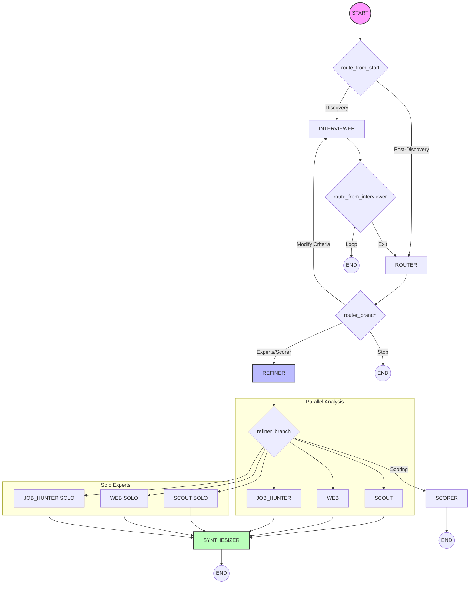

# Multi-Agent Architecture ODIS

Cette architecture remplace l'ancien prompt monolithique par un système d'agents spécialisés capables de mieux gérer le contexte et les transitions de phase.

## 🏗️ Structure des Agents

Les agents sont situés dans `app/agents/` :

- **`graph.py`** : Graph LangGraph définissant l'orchestration globale.
- **`router.py`** : Agent de routage décidant de la prochaine étape.
- **`state.py`** : Définition du `ODISGraphState` (Pydantic).
- **`tools.py`** : Fonctions pures utilisées par les agents.
- **`interviewer.py`** : Agent PydanticAI (Phase DISCOVERY).
- **`scorer.py`** : Agent PydanticAI (Phase SCORING).
- **`scout.py`**, **`web.py`**, **`job_hunter.py`** : Agents d'analyse (Phase ANALYSIS).
- **`synthesizer.py`** : Agent de synthèse finale.
- **`agent_config.py`** : Configuration des modèles par agent.

## 🔄 Workflow & Phases

L'orchestrateur pilote la conversation à travers trois phases :

1. **DISCOVERY** : Collecte intelligente des besoins.
2. **SCORING** : Présentation argumentée des meilleurs territoires.
3. **ANALYSIS** : Triple analyse automatique (**Scout + Web + JobHunter**) pour explorer une commune en détail.

## 🏗️ Architecture Graduée (v3)

L'architecture v3 introduit des mécanismes de contrôle rigoureux pour garantir la fiabilité des réponses.

### 🧠 State Management & Data Consistency

Pour éviter les "hallucinations de contexte" (mélange de données entre deux recherches), nous utilisons :

- **Criteria Hashing** : Un hash MD5 unique est généré à chaque modification des critères.
- **Commune Artifacts** : Les résultats des experts sont stockés de manière indexée : `{ "Commune": { "Hash": { "Expert": "Result" } } }`.
- **Synthesizer Lock** : Le synthétiseur ne peut lire que les artéfacts correspondant au hash de critères _actuel_.

### 🔀 Hybrid Expert Strategy (v3.2)

Pour garantir une convergence fiable et une réactivité optimale, le graphe gère deux modes d'exécution :

1. **Mode Full Analysis** : Pour toute demande d'analyse d'une ville, le trio d'experts (**Scout + Web + JobHunter**) est lancé en parallèle. Ils convergent vers le `SYNTHESIZER` une fois terminés.
2. **Mode Specific Ask** : Pour une question spécifique (ex: "Quelles sont les offres d'emploi ?"), le Router active uniquement l'expert concerné (**Solo**) qui répond directement via le `SYNTHESIZER` sans attendre les autres.
3. **Cache-First** : En mode `full_analysis`, chaque expert utilise le cache (`commune_artifacts`) pour éviter les appels redondants.



## ⚡ Optimisations de Performance

### 🔀 Router Bypass Pattern (SOTA)

Pour réduire la latence et la consommation de tokens, le graphe utilise un **point d'entrée intelligent** :

- **Concept** : Si l'utilisateur est déjà en phase d'interview (`active_agent == "interviewer"`), le `START` du graphe redirige directement vers l'Interviewer sans passer par l'agent Router.
- **Gain** : Économie de ~1000 tokens par tour et suppression du délai d'inférence du Router.
- **Sortie** : L'Interviewer boucle sur lui-même tant que `is_interview_complete` est `False`.

### 📦 Batching Standardisé (Tous Agents)

- **Solution** : `search_referentiels_batch_tool`.
- **Fonctionnement** : Utilisé par **tous les agents** (Interviewer, Scout, JobHunter) pour envoyer plusieurs requêtes de recherche en **un seul tour de parole**.
- **Gain** : Réduit les "doubles facturations" de contexte et accélère la collecte/normalisation de données.

### 💼 Batch Job Search

L'agent **JobHunter** doit souvent rechercher des offres pour plusieurs métiers (ROME) différents pour une même ville.

- **Solution** : `search_job_offers_batch_tool`.
- **Fonctionnement** : Permet de lancer plusieurs recherches France Travail en une seule interaction.
- **Gain** : Optimise la latence et les tokens lors de l'exploration multi-métiers.

## 🛠️ Outils & Capacités

- `search_referentiels_batch` : Identification précise des données (Communes, ROME, Formations, etc.) - Standardisé sur tous les agents.
- `compute_top_cities` : Moteur de scoring ODIS.
- `search_places` / `compute_routes` (Google Maps) : Expertise terrain.
- `google_search` (Native Capability) : Grounding web en temps réel (utilisé par l'agent WEB).
- `search_job_offers_batch` (France Travail) : Offres d'emploi en direct (optimisé).
- `search_refugee_associations` (RNA) : Associations spécialisées dans l'accueil des réfugiés.

## 📝 Configuration des Modèles (Janv 2026)

- Router / Interviewer / Synthesizer : `gemini-3-flash-preview`.
- Scorer / Refiner / Experts : `gemini-2.5-flash-lite`.

## ⚙️ Async Loop Management (Architecture Critique)

### Le Problème "Event Loop is Closed"

Streamlit exécute chaque re-run dans un thread séparé mais partage parfois des ressources globales. L'erreur `Event loop is closed` survient quand un client `genai.Client` (ou `httpx.Client`) est instancié globalement ou attaché à une boucle d'événement précédente qui a été fermée par Streamlit.

### La Solution Robuste (2026)

Nous avons mis en place une architecture d'isolation stricte :

1.  **Isolation de Thread** : Le graphe LangGraph s'exécute dans un `ThreadPoolExecutor` dédié via `run_async_in_thread`.
2.  **Isolation de Boucle** : À l'intérieur de ce thread, nous utilisons `asyncio.run()`, ce qui garantit une boucle d'événement fraîche pour chaque interaction.
3.  **Injection de Client (CRITIQUE)** :
    - Nous instancions un `genai.Client` _à l'intérieur_ de ce thread protégé.
    - Nous injectons EXPLICITEMENT ce client dans **chaque** agent PydanticAI via `GoogleProvider(client=deps.client)`.
    - Cela empêche les agents d'utiliser un client global "caché" qui serait rattaché à une boucle morte.

```python
# Pattern d'injection dans graph.py
def _get_p_model(agent_name: str, client: genai.Client) -> GoogleModel:
    provider = GoogleProvider(client=client) # <-- Le secret est ici
    return GoogleModel(name, provider=provider)
```
