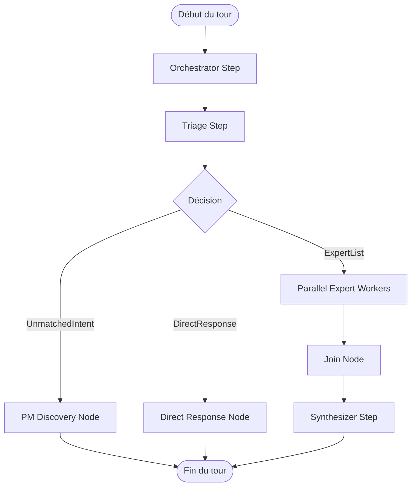

# Retour d'Expérience : Gestion de Connaissances Sémantiques & Multi-Agents avec PydanticAI

Ce document synthétise les choix d'architecture, les défis résolus et les design patterns appliqués sur le projet **TS-Buddy** (accompagnement social intelligent) pour servir de guide à d'autres projets exploitant l'écosystème **PydanticAI** et **pydantic_graph**.

---

## 1. Objectif Métier : Ce que nous avons construit

L'objectif de **TS-Buddy** est de guider des bénéficiaires dans leurs démarches d'accompagnement social (logement, santé, emploi, juridique). Pour cela, le système doit :
1.  **Qualifier le besoin** (comprendre la demande, souvent complexe et multi-facettes).
2.  **Orienter vers des experts métiers** dédiés (logement, santé, etc.) fonctionnant en parallèle.
3.  **Garantir la fiabilité des réponses** en forçant l'usage de référentiels réglementaires officiels et de bases de données locales (ex: annuaires de commissions DALO, critères de délais d'attente basés sur le code INSEE/département du bénéficiaire).

---

## 2. Patterns d'Architecture sous PydanticAI

### A. Supervision Conversationnelle avec `pydantic_graph`
Plutôt que d'adopter des frameworks de graphes lourds, le projet s'appuie sur `pydantic_graph`.
*   **Avantage** : Typage fort complet du graphe, de son état et de ses transitions.
*   **Blackboard Pattern** : Un état global mutable ([GraphState](file:///Users/jacques/dev/ts-buddy/src/social_agent_core/graph/models.py#L60)) accumule les données récoltées, les Skill Cards découvertes et les réponses des différents experts à chaque tour de parole.
*   **Transitions Typées** : Les transitions sont modélisées par des classes Pydantic simples (ex: `ExpertList` pour déclencher les exécutions parallèles, `DirectResponse` pour renvoyer une réponse immédiate sans mobiliser d'experts).



---

### B. L'Assemblage Dynamique d'Agent (Dynamic Agent Assembly)
C'est le pattern le plus crucial de notre architecture. Un agent expert n'est **pas une instance statique**. Il est assemblé à la volée en fonction des **Skill Cards** découvertes lors de l'étape de triage sémantique.

#### Pourquoi ce pattern ?
*   **Économie de tokens** : Un agent expert ne possède que les instructions et les outils nécessaires à la résolution de la demande en cours.
*   **Sécurité et scope** : Si une démarche ne requiert pas d'accès à une API externe (ex: API France Travail), le LLM n'a physiquement pas accès à l'outil associé, ce qui élimine les hallucinations d'appels d'outils hors-sujet.

#### Implémentation
1.  **Récupération des Skill Cards** : L'orchestrateur effectue une recherche sémantique s'appuyant sur l'embedding 128d de la question utilisateur (via `google-gla:text-embedding-004` et `sqlite-vec`).
2.  **Conversion en "Capabilities"** : Chaque Skill Card définit les outils requis (`allowed_sources`).
3.  **Instanciation** : La factory [get_expert_agent](file:///Users/jacques/dev/ts-buddy/src/social_agent_core/agents/tools_registry.py#L164) crée l'agent PydanticAI en concaténant les instructions des cartes au prompt système de base et en enregistrant uniquement les toolsets autorisés :

```python
# Extrait du patron d'assemblage dynamique
capability_instructions = []
all_toolsets = []

for card in active_skill_cards:
    # Convertit les sources de la carte en toolsets réels (ex: basic_lookup, web_custom)
    cap = skill_card_to_capability(card, deps, resolved_domains)
    capability_instructions.append(cap.instructions)
    all_toolsets.extend(cap.toolsets)

# Construction de l'agent à la volée
agent = Agent(
    model,
    system_prompt=base_prompt + "\n" + "\n".join(capability_instructions),
    toolsets=all_toolsets,
    deps_type=BeneficiaryState,
    output_type=AgentArtifact
)
```

---

### C. La Restriction Dynamique d'Outils (Prepare Hooks)
Pour garantir que le LLM n'interroge que des sources autorisées (par exemple, des sites gouvernementaux officiels ou locaux), nous utilisons les **Prepare Hooks** de PydanticAI.

*   **Principe** : Le toolset de recherche Web est préparé dynamiquement en lui injectant une fonction de restriction.
*   **Fonctionnement** : La fonction de restriction intercepte la définition des outils (`ToolDefinition`) avant qu'elle ne soit envoyée au LLM et y injecte dynamiquement des contraintes textuelles (comme une whitelist de domaines autorisés) dans la description des paramètres de l'outil.
*   **Bifurcation de recherche** : Le moteur natif `google_search` de Gemini est automatiquement désactivé si une liste de domaines spécifiques est requise, basculant l'exécution sur un outil de recherche tiers (Brave Search) configuré avec la whitelist sémantiquement résolue.

```python
def create_domain_restrictor(allowed_domains: set[str]):
    """Prepare hook de PydanticAI pour annoter dynamiquement les descriptions d'outils."""
    async def restrict_to_allowed_domains(ctx: RunContext, tool_defs: list[ToolDefinition]) -> list[ToolDefinition] | None:
        if not allowed_domains:
            return tool_defs
        domains_str = ", ".join(allowed_domains)
        return [
            replace(td, description=f"{td.description}\n[RESTRICTION] Authorized domains: {domains_str}")
            for td in tool_defs
        ]
    return restrict_to_allowed_domains

# Enregistrement de l'outil préparé
ts = get_web_search_tools(deps.search, deps.scraper, allowed_domains=all_allowed)
toolsets.append(ts.prepared(create_domain_restrictor(set(all_allowed))))
```

---

### D. Isolation et Optimisation du Contexte (`ContextBuilder`)
Pour éviter le phénomène de "Lost in the Middle" (où le modèle ignore des informations noyées dans un trop grand contexte), nous avons implémenté le [ContextBuilder](file:///Users/jacques/dev/ts-buddy/src/social_agent_core/context.py).

*   Chaque agent expert dispose d'une méthode de filtrage dédiée (ex: `_health_context`, `_housing_context`).
*   Le prompt utilisateur envoyé à l'agent n'est pas un historique brut, mais un objet JSON sérialisé contenant **uniquement** les champs du profil du bénéficiaire pertinents pour cet expert.

---

### E. Traçabilité et Monitoring
Tous les toolsets du projet héritent d'une classe wrapper [TracedToolset](file:///Users/jacques/dev/ts-buddy/src/social_agent_core/agents/tools_registry.py#L57) qui surcharge `call_tool`.
*   Elle ouvre automatiquement un span **Logfire** (`logfire.span(...)`) contenant le nom de l'outil et ses arguments pour chaque appel du LLM, assurant un monitoring de production en temps réel.

---

## 3. Synthèse des Recommandations pour le Nouveau Projet

Si vous démarrez un projet similaire sous PydanticAI, suivez ces principes :

1.  **Préférez `pydantic_graph` à LangGraph** si vous cherchez une intégration native avec Pydantic, un typage statique fort (`mypy`/`pyright`) et une gestion simplifiée de l'état asynchrone.
2.  **N'écrivez pas de prompts géants avec tous les outils**. Utilisez l'assemblage dynamique : chargez les instructions métiers (prompts) et activez les outils (`toolsets`) uniquement au moment de l'exécution, en réponse au besoin qualifié par l'orchestrateur.
3.  **Contrôlez les appels d'outils externes** via les `prepare` hooks de PydanticAI. C'est le moyen le plus propre pour ajouter des contraintes dynamiques (géographiques, droits d'accès, filtres de domaines) sans modifier le code de base de l'outil.
4.  **Structurez vos dépendances** en lecture seule (les clients d'API, bases de données) dans un conteneur comme `GraphDeps`, et les données mutables dans le `GraphState`.
