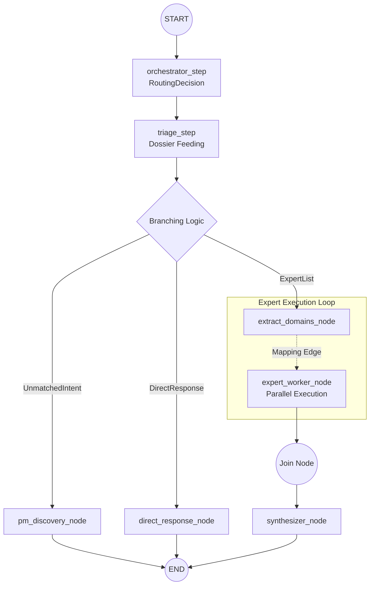

# Architecture Reference: Social Agent Core

## 1. System Overview

The `ts-buddy` Social Agent Core is a stateless, serverless-friendly orchestrator designed to route, process, and synthesize multi-agent conversations. It transitions away from the hardcoded ODIS pipeline toward a generic, domain-agnostic `pydantic-graph` engine.

## 2. Project Structure

```text
src/social_agent_core/
├── api/                # FastAPI endpoints
│   ├── server.py       # Main entry point
│   └── ui_gateway.py   # PydanticAI FunctionModel bridge
├── graph/              # pydantic-graph orchestration
│   ├── nodes/          # Graph node definitions
│   ├── builder.py      # Graph construction logic
│   └── models.py       # GraphState & RoutingDecision DTOs
├── models/             # Pydantic data models
│   ├── state.py        # BeneficiaryState (Source of Truth)
│   ├── artifacts.py    # Standardized agent outputs
│   └── discovery.py    # PM Skill Proposals
├── privacy/            # PII Masking (Presidio)
└── agents/             # Agent registry & prompt templates
    ├── prompts/        # Individual expert markdown prompts
    ├── tools/          # Nature-based toolsets (API, Semantic, Geo)
    └── tools_registry.py # Agent factory with Web Grounding
├── knowledge/          # Knowledge Store & MCP logic
│   ├── models.py       # SkillCard & AllowedSource schema
│   ├── store.py        # SQLite-vec implementation (persistent)
│   └── mcp_servers/    # Domain-specific MCP tools
├── catalog/            # Managed Knowledge Catalog (Domain-grouped)
│   ├── health/         # Skill Cards (.md) + knowledge.db
│   ├── housing/
│   └── ...
```

## 3. Core Components

### 3.1 The Data Layer (Pydantic)

- `BeneficiaryDossier`: The core data model containing identity summaries and 8 domain-specific profiles. This serves as the "pure" state without session metadata.
- `BeneficiaryState`: The universal blackboard carrying session metadata, interaction history, and inheriting all fields from `BeneficiaryDossier`. This is the single source of truth for the graph.
- `BeneficiaryStateUpdate`: A dynamically generated, recursive partial version of `BeneficiaryDossier`. All fields are `Optional` and default to `None`, ensuring that LLM-driven state updates (Dossier Feeding) are strictly typed and always in sync with the main model.
- `AgentArtifact`: The standardized return type for all Expert Agents, ensuring consistent confidence scoring and grounding (Source Citations).
- `SkillProposal`: A mechanism to capture unmatched user intents and transform them into PM-reviewable feature requests.

### 3.2 The Privacy Layer (Presidio)

All incoming user text is intercepted by the `PIIMasker` before state insertion.

- **Engine**: Microsoft Presidio Analyzer + Anonymizer.
- **Model**: `fr_core_news_md` (spaCy) for French Named Entity Recognition.
- **Pattern**: Replaces entities with standard tags (e.g., `<PERSON>`, `<PHONE_NUMBER>`).

### 3.3 The Context Builder

An adaptation of the ODIS Context mechanism. It prevents LLM hallucination and context-window bloat by assembling targeted state snapshots.

- Utilizes strict `allow_lists` per agent, filtering the `BeneficiaryState` to relevant profiles.
- Formats profiles into concise JSON summaries for the LLM context.
- Includes the `problem_to_solve` in all expert contexts.

### 3.4 The Graph Layer (pydantic-graph V2)

Utilizes the `pydantic-graph` V2 architecture with functional step nodes and `GraphBuilder`.



- `Graph Models`: Consistently defined in `graph/models.py` to eliminate circular import issues. This file includes `GraphState` (mutable blackboard) and routing DTOs (`ExpertList`, `DirectResponse`, `UnmatchedIntent`).
- `orchestrator_step`: Uses structured output (`RoutingDecision`) to determine user intent.
- `triage_step`: Applies `state_updates` (dossier feeding) and translates the `RoutingDecision` into concrete routing DTOs.
- `expert_worker_step`: Invokes real Pydantic AI agents. Executed in **parallel** via `g.add_mapping_edge`.
  > [!IMPORTANT]
  > **Logfire Observability Gate**: Every node must explicitly include `session_id="{ctx.state.beneficiary.session_id}"` in its `@logfire.instrument` decorator. This is required to enable "flat-searching" in the Logfire UI, as OpenTelemetry attributes do not propagate to child spans by default.
- `synthesizer_step`: Runs as a fan-in collector (via `g.join`) once all parallel expert outputs are collected.

### 3.9 J2BD Confirmation Handshake

To ensure alignment and reduce latency, the system implements an explicit validation loop before triggering experts.

- **Interception Logic**: The `orchestrator_step` checks for a literal `"Confirmer"` in the user's latest message. If found (and if experts were previously staged), it bypasses the LLM call entirely.
- **Staging**: The `triage_step` persists proposed experts into `state.beneficiary.required_experts` when the objective is not yet actionable (`is_objective_actionable=False`).
- **UI Integration**: Uses bold text instructions (e.g., `Tapez **Confirmer**`) to facilitate the handshake, as the native `to_web` UI currently sanitizes/blocks custom markdown button schemes.
- **Consistency Fallback**: Even in keyword-based fallback (`_simple_route`), the handshake is enforced for consistency.

### 3.5 The API Layer (FastAPI)

- `ChatRequest` / `ChatResponse` models for external clients.
- Executes a single-turn operation via `await graph.run(state=graph_state)`. The V2 engine mutates the state in-place and returns the synthesized string directly.

### 3.6 The UI Layer (PydanticAI Web UI)

A native, high-quality chat interface provided by PydanticAI.

- **Pattern**: `gateway_agent.to_web()` generates a Starlette app that serves the UI and its API.
- **FunctionModel Bridge**: To avoid the latency and token cost of an extra LLM "passthrough", a `FunctionModel` is used as the gateway. This model runs local Python code that directly invokes the `pydantic-graph`.
- **Privacy**: User input is masked via `PIIMasker` within the `FunctionModel` before being passed to the graph.

### 3.7 Observability (Logfire)

The core engine uses Pydantic Logfire for execution tracing and performance monitoring.

- **Instrumentation**: Native Pydantic AI and Pydantic Graph nodes are instrumented.
- **Hierarchical Spans**: Each API request creates a root "Chat Turn" span, nesting all node executions and LLM calls.
- **Session Filtering**: Every span includes a structured `session_id` attribute, allowing unified filtering of multi-turn conversations across the entire platform.
- **Privacy in Traces**: Currently configured to send raw data for debugging during testing phases.

### 3.8 Agent Tooling & Standardized Services

Agents use a strictly-typed tool injection pattern to maintain a separation between pure logic and cloud-native service operations.

- **`Standardized Services`**: Core logic for external APIs and databases is encapsulated in dedicated service classes:
    - `BigQueryKnowledgeService`: Unified client for all domain lookups (referentiels, associations, CCAS) using semantic, geographic, and basic lookup patterns.
    - `EmploymentService`: Specialized clients for France Travail (OAuth2) and Emplois de l'Inclusion.
    - `MapService`: Modern Google Maps V1/V2 clients for POIs and Routing.
- **`FunctionToolset`**: Domain-expert agents are equipped with dynamic toolsets built by a centralized factory (`tools_registry.py`).
- **`RunContext[BeneficiaryState]`**: Context-aware tools receive the beneficiary's dossier, providing type-safe access to the "Source of Truth" (e.g., current location for city-specific searches).
- **Batching Strategy**: To minimize latency and token round-trips, tools are designed for batch execution (e.g., `search_jobs_batch`), allowing the LLM to query multiple items in a single tool call.

### 3.10 Knowledge Catalog & Strict Grounding
Expert capabilities and domain knowledge are managed through a modular catalog of Markdown files, providing a low-code way to extend the system.

- **Skill Card**: A structured Markdown file in `/catalog/<domain>/`. It contains YAML frontmatter defining the `skill_id`, `domain_id`, and a list of `allowed_sources`.
- **Allowed Sources & Constraints**: Each skill defines its trusted data sources (e.g., `web_custom`, `api_lookup`, `semantic_rag`). For web sources, specific `domains` (white-lists) are enforced via native hooks.
- **Persistent Knowledge Store (Embedder)**: The `KnowledgeStore` provides fast semantic lookup of Skill Cards. It uses a persistent database (`catalog/knowledge.db`) and leverages the native `pydantic_ai.Embedder` for provider-agnostic vector generation (768d).
- **Strict Grounding Enforcement**: During agent construction in `tools_registry.py`, the system:
    1. Collects all `domains` from the active Skill Cards.
    2. Applies a **`prepared()` hook** (`restrict_to_allowed_domains`) to the toolset. This hook programmatically modifies tool descriptions at runtime to strictly enforce whitelisted domains.
    3. Bundles tools and instructions into **`SkillCapability`** objects (mimicking Harness Capabilities) for clean dependency management.
- **Observability (WrapperToolset)**: All toolsets are wrapped in a `TracedToolset` (`WrapperToolset`) to ensure every execution is captured in Logfire with `tool:{name}` spans.

### 3.11 Deep Grounding (Search-then-Scrape)
For information not found in the Knowledge Store, the orchestrator/experts can trigger a trusted web search:
- **Strategy**: **Atomic Search & Scrape**. A single tool call identifies top URLs from a whitelist and immediately scrapes their full content into Markdown.
- **Provider**: Brave Search API (v1) for identification.
- **Extraction**: `trafilatura` is used to remove boilerplate (menus, ads) and extract high-density text, optimizing token usage while providing the full context of official pages.
- **Parallelism**: Scraping of multiple pages (Top 3-5) is executed in parallel via `asyncio.gather` to minimize latency.
- **Safety**: Domain whitelists are enforced both at the search level (API params) and at the scraper level (domain validation).

### 3.12 Granular Model Configuration

The system allows fine-grained control over LLM parameters for each node in the supervisor graph.

- **`NodeConfig`**: A Pydantic model encapsulating `model`, `temperature`, and `thinking` level.
- **Pydantic Settings Integration**: Uses `env_nested_delimiter="__"` to allow environment overrides like `SAC_ORCHESTRATOR__TEMPERATURE=0.7`.
- **Unified Thinking Settings**: Leverages Pydantic AI's unified `thinking` field (`minimal`, `low`, `medium`, `high`, `xhigh`) which is automatically mapped to provider-specific configurations (e.g., `thinking_level` for Gemini).
- **Node-specific defaults**: Defaults are defined in `config.py` for `orchestrator`, `expert`, `synthesizer`, and `pm_discovery`.

### 3.13 Graph Dependency Injection (`GraphDeps`)

To maintain clean architecture and testability, all shared services are injected via `GraphDeps`.

- **Registry**: `GraphDeps` carries the `KnowledgeStore`, `BigQueryKnowledgeService`, `FranceTravailClient`, `EmploisInclusionClient`, `GoogleMapsClient`, `BraveSearchClient`, and the **`ScraperService`**.
- **Injection**: These services are initialized in the FastAPI lifespan. The `BraveSearchClient` and `ScraperService` work in tandem for the Auto-Scrape grounding pattern.
- **Access**: Step nodes and Tool factories receive these services as dependencies. Expert agents receive tools and instructions bundled into `SkillCapability` objects.

> [!IMPORTANT]
> **Hybrid Context Strategy & Latency**: Expert agents receive a summarized JSON view of the state via the `ContextBuilder` (for speed) but are also equipped with context-aware tools for deep inspection. This often triggers a **ReAct loop** (extra LLM round-trip) which increases token usage and latency in exchange for higher reasoning precision and zero-hallucination data access.

## 4. Testing Strategy (VCR & Determinism)

The Social Agent Core uses `pytest-recording` (VCR.py) to achieve deterministic integration testing without the fragility of manual mocks.

### 4.1 VCR Recordings (Cassettes)
LLM interactions are recorded into YAML "cassettes" located in `tests/cassettes/`. 
- **Offline Reliability**: Once recorded, tests run 100% offline, eliminating network latency and API costs in CI/CD.
- **Redaction**: Sensitive headers (`x-goog-api-key`, `Authorization`) are automatically redacted in `tests/conftest.py`.
- **JSON Integrity**: To prevent corruption of structured LLM outputs, automated body scrubbing (PII regex) is intentionally avoided at the VCR layer.

### 4.2 Time Determinism (`freezegun`)
All VCR-marked tests are decorated with `@freeze_time`.
- **Purpose**: Ensures that `BeneficiaryState` timestamps and `session_id` fields match the recorded cassettes exactly across different execution dates.
- **Current Reference**: Tests are pinned to `2026-04-28 17:52:00` (current year) to avoid SSL certificate validation issues that occur when freezing to old dates.

### 4.3 High-Fidelity Scenarios
The suite includes complex, multi-turn scenarios (e.g., `test_scenario_syrian_family.py`) that exercise:
- **Dossier Feeding**: Accumulation of state across multiple turns.
- **Parallel Fan-out**: Concurrent execution of multiple domain experts.
- **Handshake Validation**: Correct interception of "Confirmer" triggers.
