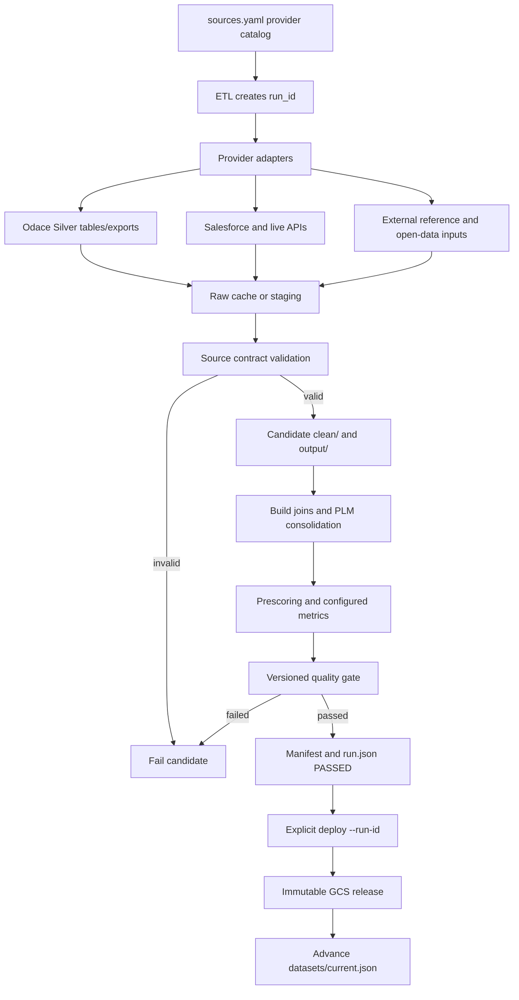

# ODIS data ingestion and build pipeline

This directory contains the offline ETL pipeline for ODIS. It retrieves,
normalizes and consolidates active data sources into a candidate release of
Parquet files consumed by the application.

The current architecture is intentionally split into three boundaries:

1. provider adapters and source-level contracts;
2. an isolated candidate run with a versioned release quality gate;
3. an explicit deployment step that publishes only a passed candidate.

For commands and operational usage, see [README.md](README.md).

## End-to-end flow



`--step all` ends at the passed candidate by default. The active release
pointer moves only after an explicit deployment: either a separate
`--step deploy --run-id …` command or `--step all --deploy`.

## 1. Provider and ingestion boundary

The active provider catalog is [sources.yaml](sources.yaml). It describes
which data is required, which provider supplies it and, where applicable, the
Odace Silver table name.

### Odace

Odace is the active source for the normalized datasets declared with
`use_odace: true`. [odace_client.py](odace_client.py) supports both paginated
queries and Parquet exports, depending on the table. Large tables such as BPE
and RNA use the export path where appropriate.

Odace export artifacts are downloaded into a staging file, checked for Parquet
readability and then promoted with an atomic replacement. When a request fails,
the client may reuse an existing Odace cache; it never reactivates a retired
manual download. If no readable Odace artifact is available, the required clean
step fails. The raw last-known-good cache is therefore distinct from the
archived legacy source implementations.

### Other active providers

The pipeline also has deliberate non-Odace adapters:

- Salesforce provides the single active J'Accueille BDV aggregate used both by
  scoring and by result details;
- France Travail and Les emplois de l'inclusion provide live job datasets;
- BigQuery RNA RAG provides the configured association enrichment;
- INSEE, education, electoral, postal-code, formation and other reference
inputs remain active where the build requires them.

Odace rent facts are joined to the candidate communes through the persisted
`commune_sk` key. A missing key, missing rent artifact or invalid rent join
fails the candidate; the archived `loyers` source is not an active fallback.

The former manual J'Accueille CSV/XLSX and BigQuery paths, together with the
retired direct-download cleaners for Odace-backed tables, are preserved under
[legacy_ingest/](legacy_ingest/). That package is archival and is not imported
or executed by the default ETL.

## 2. Staging, validation and candidate paths

Each `PipelineRun` in [run_context.py](run_context.py) owns:

```text
pipeline/cache/runs/<run_id>/
├── run.json       # state, step results and source outcomes
├── clean/         # candidate-scoped cleaned intermediates
└── output/        # candidate release artifacts and manifest
```

The provider raw cache under `pipeline/cache/raw/` remains shared as a
last-known-good input cache. RAG-derived aggregates additionally use the
shared `pipeline/cache/clean/` directory as a TTL-governed provider cache; a
valid RAG artifact is copied into the candidate before use. Other clean and
output artifacts are rebound to the candidate before the ETL invokes ingest,
build or prescoring. Consequently, a candidate cannot publish a mixture of
another run's clean/output artifacts.

`run_clean_step_safely` applies the source boundary:

1. acquire or reuse the raw input according to its provider policy;
2. validate the raw data against the source configuration;
3. run the cleaner into the candidate clean directory;
4. require a readable, non-empty output for a required step;
5. propagate failures so the candidate becomes non-deployable.

The last-known-good raw cache is not evidence that the current required clean
step succeeded.

## 3. Contract layers

### Source contracts

The source catalog's `used_columns` and provider metadata define the first
contract boundary. [common.py](common.py) validates required columns and basic
data validity before promotion. Cleaners also perform source-specific checks,
such as identifier and geography requirements.

### Release contract

[data_contracts.yaml](data_contracts.yaml) is the versioned contract for the
published scoring bundle and source facts that have an explicit semantic
boundary. Version 1 currently declares:

- the required release artifact set;
- minimum commune row count;
- required commune columns and the unique, non-null `codgeo` key;
- minimum coverage for department, region, EPCI and BdV identifiers;
- the configured minimum non-null fraction for precomputed score metrics;
- the communes-to-BdV join and its maximum orphan fraction.

For example, `housing_occupation` consumes Odace's
`fact_occupation_logement` table under a source contract: RP 2022 only, one
row per commune/year/occupation indicator, all six raw count indicators needed
for the weighted occupation score, sufficient commune coverage and non-negative
non-null values. Its old Data.gouv ZIP cleaner is retained only in
`legacy_ingest/` and is not a runtime fallback.

The quality gate in [quality_gate.py](quality_gate.py) reads this contract and
derives the precomputed score list from
[app/scores_config.yaml](../app/scores_config.yaml). It produces a detailed
summary with the contract version and individual checks. It does not mutate
artifacts or deployment state.

The ETL writes the summary to `pipeline/cache/runs/<run_id>/quality_report.json`
for both successful and failed gate evaluations. A candidate reaches `PASSED`
only after the release gate and manifest generation have succeeded.

## 4. Build semantics and PLM consolidation

The build phase joins the candidate clean datasets into commune, BdV, POI and
vertical outputs, resolves geographic relationships, stores commune polygons
as WKB for efficient application loading, and computes the inputs required by
prescoring.

Paris, Lyon and Marseille are represented by a parent commune plus
arrondissements. [build.py](build.py) declares an explicit metric policy rather
than inferring aggregation from column names:

- parent values are authoritative, including zero;
- additive measures use complete child sums only when the parent is missing;
- rates and means use population-weighted child means;
- parent-only metrics remain missing rather than being invented from children;
- declared flags use the maximum child value;
- unknown numeric metrics and incomplete child families fail closed.

The parent replaces its children in the commune output. Vertical aggregation
and detail-list remapping preserve existing parent records and do not create a
duplicate parent from child rows.

## 5. Prescoring, manifest and quality gate

Prescoring computes configured derived indicators and scaled values after PLM
consolidation. It then runs `run_quality_gate` against the candidate output.

The manifest builder in [manifest.py](manifest.py) records the active source
catalog, provider metadata, Odace table metadata where available, timestamps and
row counts. The ETL completes the manifest with:

- `pipeline_run_id`;
- the quality-gate summary.

The manifest is written to the candidate output directory. Its deterministic
manifest version is retained as source metadata, while the deployment release
ID is the explicit `run_id` used by the deployment command.

## 6. Run state and publication boundary

`run.json` is the authoritative state record for a candidate. The relevant
states are:

- `RUNNING`: execution is active or may continue;
- `PASSED`: required processing, quality gate and manifest generation succeeded;
- `FAILED`: a required phase, contract, quality gate or manifest failed.

Source outcomes are recorded separately as `refreshed`, `reused_within_ttl`,
`fallback_last_good`, `skipped_optional` or `failed`. These outcomes preserve
the distinction between a valid cache reuse, a refresh and a failure.

Deployment requires all of the following:

1. an explicit `--run-id`;
2. a matching `run.json` in `PASSED` state;
3. a passed quality gate in that run record;
4. a manifest whose `pipeline_run_id` matches the requested run;
5. every required release artifact present and non-empty.

The deployment operation uploads the validated dataset files under an
immutable GCS release prefix and advances `datasets/current.json` only after
the upload. The local `app/data` mirror is updated after successful
publication. A failed candidate cannot advance the active release pointer.

## 7. File roles

- [etl.py](etl.py): orchestrates phases, candidate binding and deployment.
- [run_context.py](run_context.py): creates isolated run directories and
  validates deployability.
- [ingest.py](ingest.py): provider acquisition, source validation and cleaning.
- [odace_client.py](odace_client.py): Odace query/export client and cache
  staging.
- [build.py](build.py): joins, geography, PLM policies and release outputs.
- [prescoring.py](prescoring.py): derived metrics, scaling and gate invocation.
- [quality_gate.py](quality_gate.py): non-mutating release contract checks.
- [data_contracts.yaml](data_contracts.yaml): versioned release contract.
- [manifest.py](manifest.py): source and release manifest generation.
- [common.py](common.py): shared loading, validation, logging and atomic-swap
  helpers.
- [sources.yaml](sources.yaml): active source/provider catalog.
- [legacy_ingest/](legacy_ingest/): opt-in archival manual ingestion code; it
  is outside the default pipeline.
