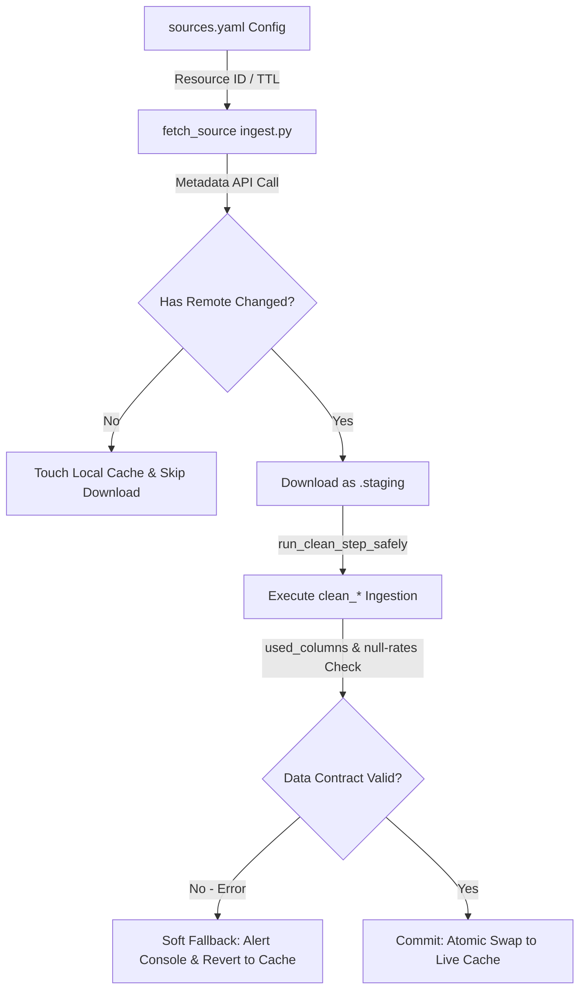

# ODIS Data Ingestion & Build Pipeline (Pipeline v2)

This directory contains the **offline ETL (Extract, Transform, Load) pipeline** for the ODIS application. Its purpose is to fetch, clean, validate, and aggregate static and live open datasets into optimized Parquet stores that the Streamlit application loads instantly.

The pipeline implements an advanced, resilient data architecture designed for performance, high availability, and robustness against upstream changes.

---

## 🚀 Quick Start

### Prerequisites
- Python 3.10+
- A virtual environment set up and active

### Installation
1. Activate your virtual environment:
   ```bash
   source .venv/bin/activate
   ```
2. Install pipeline dependencies:
   ```bash
   pip install -r pipeline/requirements.txt
   ```
3. Configure environment variables in `pipeline/.env`:
   ```env
   ODACE_API_URL=https://odace.services.d4g.fr
   ODACE_API_KEY=sk_live_...
   ```

### Usage
Run the pipeline using the `etl.py` script from the project root:
```bash
# Run the full pipeline (Ingest + Build + Prescoring + Deploy)
python -m pipeline.etl --step all

# Run only the Ingest step (Fetch & Clean under Shadow Staging)
python -m pipeline.etl --step ingest

# Run only the Build step (Aggregate & Export)
python -m pipeline.etl --step build

# Run only the Prescoring step (Ratios & Percentile Scaling)
python -m pipeline.etl --step prescoring

# Run only the Deploy step (Copy to app data directory)
python -m pipeline.etl --step deploy
```

#### Optional Ingestion Flags
- `--skip-live-jobs`: Skip fetching live job offers from the France Travail API.
- `--skip-inclusion-jobs`: Skip fetching job openings from *Les emplois de l'inclusion* API.

---

## 📐 Pipeline v2 Architecture & Resiliency Invariants

Pipeline v2 introduces robust mechanisms to prevent bad raw data from corrupting active application caches.



### 1. Config-Driven Caching & TTL Policies
Caching is governed declaratively in [sources.yaml](file:///Users/jacques/dev/13_odis_stream2/pipeline/sources.yaml) under the `ttl_days` key for each source. At launch, the pipeline compares the file's last modified timestamp (`st_mtime`) against this TTL.
- **Cache Expiration Checklist**: The pipeline prints a clear warning in the console at startup indicating which non-datagouv datasets have expired TTLs, guiding operators to manual updates if necessary.

### 2. Lightweight Update Checks (data.gouv.fr API)
To conserve bandwidth and speed up runs, the pipeline automatically extracts the `datagouv_resource_id` from sources. Before downloading:
- It queries the stable `data.gouv.fr` API (`/api/1/datasets/r/{resource_id}`) for the `Last-Modified` header.
- If the remote modification date is older than or equal to the local cache's modification date, the pipeline **skips the download** and touches the local cache to reset its TTL countdown.

### 3. Blue-Green "Shadow Staging" Ingestion
Ingestion processes run entirely in isolated **staging buffers** (`staging_*`) to protect active data:
- Raw downloads are saved as `staging_<local_name>`.
- Any cleaning scripts wrap their executions in `run_clean_step_safely` (defined in [ingest.py](file:///Users/jacques/dev/13_odis_stream2/pipeline/ingest.py)).
- **Safety Backups**: Before the cleaning script executes, all existing active raw and clean Parquet files are moved to `<filename>.active_bak` backups.
- **Commit Phase**: If the cleaning script runs successfully and validation passes, staging files are atomically swapped into place (`atomic_swap`) and backups are deleted.
- **Soft Fallback / Rollback**: If the clean function crashes or validation fails, active files are restored from `.active_bak`, staging files are purged, and the system reverts smoothly to the last known good cache, warning the operator.

### 4. Declarative Data Contract Validation
The validation engine ensures incoming files conform to strict schemas prior to committing them:
- **Non-Empty Check**: Verifies that the ingested/cleaned DataFrames are not `None` or empty.
- **Schema Conformity**: Assures that all fields declared under the `used_columns` configuration key in [sources.yaml](file:///Users/jacques/dev/13_odis_stream2/pipeline/sources.yaml) are present in the final dataset (supporting standard index and multi-index name matching).
- **Null-Rate Guardrails**: Checks critical geographic identifier columns (e.g. `codgeo`, `INSEE_COM`, `Code commune INSEE`, etc.) to ensure null records do not exceed $5\%$. If they exceed this, validation fails.

---

## 🔄 Core Ingestion Flows & Datasets

### A. Static & Semi-Static Datasets
- **Communes Base (`communes.geojson`)**: Administrative boundaries projected to Lambert-93 (`EPSG:2154`) for spatial indexing.
- **Demographics & Socioeconomics**: Demographics (`population`), age structures (`population_details`), active employment/unemployment counts (`population_active`), housing vacancy (`lovac` - LOVAC), social housing counts (`rpls` - RPLS), over-occupancy metrics (`housing_occupation`), and child-care coverage (`caf`).
- **Education (`education_annuaire` / `education_effectifs`)**: School geolocations, student counts, and school size risk indicators.
- **Formations (`formations_annuaire` / `formations_referentiel`)**: Lists UAI educational entities mapped to `codgeo` using a clean codes postaux index (`codes_postaux`).

### B. Special API & Remote Integrations
1. **BigQuery RNA RAG Ingestion (`fetch_rna_rag_stats`)**:
   - Queries semantic inclusion-relevant association counts from BigQuery using vector similarity/cosine distance matching on embedding vectors (`ML.DISTANCE` query).
   - Segregates counts by thematic queries (`Bail solidaire et Intermediation Locative (IML)` and `hébergement citoyen chez l'habitant`).
   - Uses a dedicated **1-year cache TTL** for RNA data, checking age local-first.
2. **Les emplois de l'inclusion API (`clean_inclusion_jobs`)**:
   - Fetches and processes granular employment opportunities using token authentication (`EMPLOIS_INCLUSION_TOKEN` with login fallbacks in `.env`).
3. **France Travail Live Jobs API (`clean_live_jobs`)**:
   - Connects live to France Travail APIs to retrieve real-time job openings and computes territorial stress metrics.
4. **Odace Equipment & Gares API (`clean_odace_gares` / `clean_odace_rent`)**:
   - Interfaces with Odace APIs to fetch railway/transport stats and historical rental indices.
   - Implements advanced joins on `commune_sk` with normalized commune labels as a secondary fallback.
5. **Odace Silver Ingestion Datasets (Dual-Path Fallback)**:
   - Configured dynamically via `use_odace: true` in [sources.yaml](file:///Users/jacques/dev/13_odis_stream2/pipeline/sources.yaml) for datasets like `maternites`, `caf`, `logement_vacant`, `logement_social`, `mob_transports_pub`, and `population_details`.
   - Fetches silver-layer data directly from the Odace D4G API (`https://odace.services.d4g.fr`) using `ODACE_API_KEY` and `ODACE_API_URL`.
   - On network failure or API limitations (e.g. read-only key restrictions returning `501 Not Implemented` for SQL query requests), the cleaner functions catch the error and automatically fall back to the legacy open data files or cached templates, ensuring ingestion execution is never blocked.

---

## 💾 Decoupled Data & "WKB-until-Render" Optimization

To prevent Out-Of-Memory (OOM) situations on low-resource container deployments (e.g. GCP Cloud Run), the pipeline implements a decoupled storage model:

1. **Numeric vs Spatial Data Split**:
   - **`odis_communes.parquet`** holds the metadata and scores. It does *not* contain heavy GeoPandas geometries.
   - All spatial boundaries are pre-projected to Lambert-93 internally, but saved strictly as **WKB (Well-Known Binary) bytes** under the `polygon` column.
2. **Shapely Serialization Bypass**:
   - Saving geometries as raw WKB bytes avoids complex GeoParquet serializations and prevents coordinate CRS discrepancies at the file system layer.
3. **Just-in-Time (JIT) Hydration**:
   - Geometries remain in WKB bytes throughout the ingestion and scoring flows.
   - Deserialization into Shapely polygons occurs **only at the moment of drawing maps** in `maps.py` using `gpd.GeoSeries.from_wkb()`, optimizing application memory and starting speed.

---

## 📦 Generated Outputs

The pipeline produces the following Parquet files in `pipeline/cache/output/` and deploys them to `data/`:

| File | Description | Primary Key / Key Columns |
| :--- | :--- | :--- |
| **`odis_communes.parquet`** | Main scoring dataset at Commune level (includes normalized ranks & criteria scores). | `codgeo` (primary), `population`, `pop_active`, `loyer_app_m2`, `polygon` (WKB) |
| **`odis_bassins_de_vie.parquet`** | Aggregated dataset at Bassin de Vie level with dissolved geometries (holes removed). | `bassin_de_vie` (primary), `population_bv`, `pop_chomage_ratio`, `polygon` (WKB) |
| **`odis_associations_agg.parquet`** | Aggregated social inclusion association counts from RNA database. | `codgeo`, `id_waldec` (thematic codes) |
| **`odis_pois.parquet`** | Points of Interest for visual mapping (CCAS, schools, health facilities). | `id`, `type`, `lat`, `lon` |
| **`odis_referentiels.parquet`** | Unified lookups for dropdown lists and labels (removes duplicate names). | `type`, `code`, `label` |
| **`odis_formations_agg.parquet`** | Aggregated education/training counts. | `codgeo`, `formation_code` |
| **`odis_ccas.parquet`** | CCAS & SIAE contact points. | `codgeo`, `nom`, `telephone`, `courriel`, `site_web`, `adresse` |
| **`odis_refugee_associations.parquet`** | Detailed contact lists for local integration partners. | `id`, `codgeo`, `name`, `description` |
| **`odis_ft_jobs_agg.parquet`** | France Travail Live Job offers aggregated counts. | `commune` (INSEE code), `romeCode`, `total_postes` |
| **`odis_inclusion_jobs.parquet`** | SIAE granular employment openings. | `codgeo`, `siae_siret`, `siae_name`, `postes` |

---

## 🛠 File Structure & Roles

- [etl.py](file:///Users/jacques/dev/13_odis_stream2/pipeline/etl.py): Orchestrates pipeline runs, implements interactive France Travail / Inclusion jobs confirmations, prints TTL expiration checklists, and copies outputs to `data/`.
- [ingest.py](file:///Users/jacques/dev/13_odis_stream2/pipeline/ingest.py): Downloads all static and API sources under shadow staging, parses raw structures, and contains the `run_clean_step_safely` staging engine.
- [build.py](file:///Users/jacques/dev/13_odis_stream2/pipeline/build.py): Performs PLM parent-commune consolidation, joins all cleaned datasets, dissolves geometries for Bassins de Vie (removing enclaves/holes), and aggregates detail tables.
- [prescoring.py](file:///Users/jacques/dev/13_odis_stream2/pipeline/prescoring.py): Calculates final indicators and performs uniform percentile ranking (`.rank(pct=True)`) to scale metrics evenly.
- [common.py](file:///Users/jacques/dev/13_odis_stream2/pipeline/common.py): Houses central validation utilities (`validate_dataset_contract`), `sources.yaml` parsing, cache status logger, and atomic file swap engines.
- [sources.yaml](file:///Users/jacques/dev/13_odis_stream2/pipeline/sources.yaml): Configuration catalog mapping URL, Resource ID, schema contracts (`used_columns`), and custom TTL rules.
