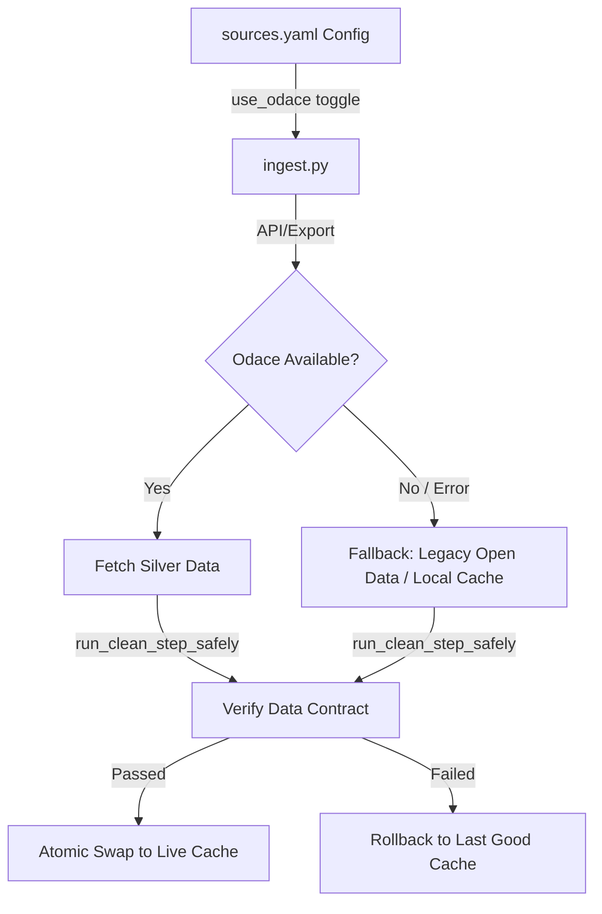

# ODIS Data Ingestion & Build Pipeline (Pipeline v3)

This directory contains the **offline ETL (Extract, Transform, Load) pipeline** for ODIS. It retrieves, sanitizes, and consolidates static and live open datasets into optimized Parquet stores loaded by the Streamlit application.

Pipeline v3 migrates ingestion to the new **Odace Silver API** (`https://odace.services.d4g.fr`) while keeping robust shadow-staging and legacy Open Data fallbacks for maximum resilience.

---

## 🚀 Quick Start

### 1. Setup Environment
Configure the Odace credentials in `pipeline/.env`:
```env
ODACE_API_URL=https://odace.services.d4g.fr
ODACE_API_KEY=sk_live_...
```

### 2. Execution
Run steps from the project root:
```bash
# Run the full pipeline (Ingest + Build + Prescoring + Deploy)
python -m pipeline.etl --step all

# Run specific steps (ingest, build, prescoring, deploy)
python -m pipeline.etl --step ingest
```

---

## 📐 Pipeline v3 Architecture



### 1. Shadow Staging & Atomic Swaps
All ingestion tasks run in isolated staging buffers (`staging_*`) wrapping cleaners in `run_clean_step_safely`. If a cleaner fails or verification crashes, the pipeline rolls back and restores active backups (`*.active_bak`), protecting running app processes.

### 2. Declarative Schema Verification
Each dataset specifies `used_columns` in `sources.yaml`. The validation engine checks:
*   DataFrame non-emptiness.
*   Required columns and indices availability.
*   Geographical identifiers null rates (must be $< 5\%$).

---

## 🔄 Odace Integration & Ingestion Flows

### 1. Odace Silver Ingestion (`use_odace: true`)
The pipeline integrates 14 primary datasets directly from the Odace platform. To support large datasets and complex schemas without server timeouts:
*   **Paginated Query API (`/api/data/query`)**: `OdaceClient` auto-paginates queries by looping over `offset` and `has_more` to safely pull tables exceeding the 10,000-row API limit (e.g. `fact_population_municipale` at 34,998 rows).
*   **Parquet Export Streaming (`/api/data/export`)**: Heavy tables like BPE (`dim_equipement_territoire` >2.78M rows) and RNA (`dim_association`) stream pre-compiled Parquet export files directly.
*   **BPE Capacity Optimization**: BPE parquet is filtered locally in Python for ODIS-relevant codes (`D502`, `D703`, `D704`, `D710`), reducing rows to ~18k, and maps `capacite_hebergement` to `CAPACITE`.
*   **PLM Population Alignment**: Arrondissement populations (Paris, Lyon, Marseille) are fully populated in the cleaned population dataset. The build pipeline uses standard population-weighted average consolidation (removing simple mean fallbacks).

### 2. Live & Remote APIs
*   **France Travail Live Jobs**: Fetches real-time jobs and computes territorial stress metrics.
*   **Les emplois de l'inclusion**: Fetches SIAE jobs using token authentication.
*   **BigQuery RNA RAG Semantic Ingestion**: Queries vector-similarity association counts from BigQuery using cosine distance matching on inclusion embeddings.

---

## 💾 Decoupled Data & Spatial Optimization
To prevent Out-Of-Memory (OOM) failures in cloud environments, the pipeline implements a **WKB-until-render** architecture:
*   **`odis_communes.parquet`** contains metadata and scoring ranks. Polygons are stored strictly as **WKB (Well-Known Binary)** bytes.
*   Deserialization into Shapely/GeoPandas geometries occurs **Just-in-Time** (JIT) only when drawing maps in `maps.py` using `gpd.GeoSeries.from_wkb()`, minimizing start-up memory usage.

---

## 🛠 File Roles
*   [etl.py](file:///Users/jacques/dev/13_odis_stream2/pipeline/etl.py): Main orchestrator for steps.
*   [ingest.py](file:///Users/jacques/dev/13_odis_stream2/pipeline/ingest.py): Downloads, page-loops, and cleans API/raw sources in staging.
*   [build.py](file:///Users/jacques/dev/13_odis_stream2/pipeline/build.py): Integrates clean tables, resolves PLM hierarchies, and dissolves spatial enclaves.
*   [prescoring.py](file:///Users/jacques/dev/13_odis_stream2/pipeline/prescoring.py): Scales final metrics using quantile rank scaling.
*   [common.py](file:///Users/jacques/dev/13_odis_stream2/pipeline/common.py): Caching, validation rules, and atomic file swap engines.
*   [sources.yaml](file:///Users/jacques/dev/13_odis_stream2/pipeline/sources.yaml): Configuration catalog for URLs, resource IDs, and schemas.
